# TradingAgents: High-Performance Go Orchestrator

[](https://codecov.io/gh/alexanderfanz/trading-agents-go)

This repository is a high-performance Go port and direct migration of the sibling Python [TradingAgents](https://github.com/TauricResearch/TradingAgents) framework. It completely replaces heavy graph framework overheads with native Go concurrency pipelines, provides zero-allocation financial indicators, and features a premium command-line interface built with HSL-harmonized Lipgloss tokens.


---

## 📊 Pipeline & Multi-Agent Architecture

The execution flow of the orchestrator utilizes a structured pipeline partitioned into five distinct logical phases. Signal interrupts (`SIGINT`, `SIGTERM`, `SIGHUP`) and context cancellations are gracefully captured at every step to prevent data corruption.

```mermaid
flowchart TD
    Start([Start Orchestrator]) --> Recovery{Checkpoint Resumption Enabled?}
    
    %% Phase A
    Recovery -- Yes --> LoadDB[Query SQL WAL Database]
    LoadDB --> CheckState{Active Checkpoint?}
    CheckState -- Found --> Resume[Restore TradingState & Resume Step]
    CheckState -- Empty --> NewState[Initialize New TradingState]
    Recovery -- No --> NewState
    
    %% Phase B
    Resume --> PhaseB[Phase B: Concurrent Market Analysis]
    NewState --> PhaseB
    
    subgraph ParallelAnalysts["Concurrent Execution (Go Routines)"]
        direction LR
        A1["Market Analyst"]
        A2["Technical Analyst"]
        A3["Sentiment Analyst"]
        A4["Fundamentals Analyst"]
    end
    
    PhaseB --> FetchData["Fetch Historical Candles & News"]
    FetchData --> ParallelAnalysts
    ParallelAnalysts --> CombineReports[Sync & Combine Analyst Reports]
    CombineReports --> Checkpoint1[Save Checkpoint 1]
    
    %% Phase C
    Checkpoint1 --> PhaseC["Phase C: Research Debate & Consensus"]
    subgraph MultiTurnDebate1["Consensus Debate Loop"]
        direction TB
        BullAgent["Bull Agent (Propose Buy)"] <--> BearAgent["Bear Agent (Propose Sell)"]
    end
    PhaseC --> MultiTurnDebate1
    MultiTurnDebate1 --> Consensus["Synthesize Consensus Strategy"]
    Consensus --> Checkpoint2[Save Checkpoint 2]
    
    %% Phase D
    Checkpoint2 --> PhaseD["Phase D: Risk & Position Sizing"]
    subgraph MultiTurnDebate2["Derivatives-Aware Risk Loop"]
        direction TB
        Trader["Trader (Propose Entry/Exit Price)"] --> OptionsStrategist["Options Strategist (Formulate CSPs/Covered Calls)"]
        OptionsStrategist --> RiskDebate["Risk Debate (Aggressive/Conservative/Neutral)"]
        RiskDebate <--> PMAgent["Portfolio Manager (Propose Sizing)"]
    end
    PhaseD --> MultiTurnDebate2
    MultiTurnDebate2 --> Decision["Produce Final Position Rating & Sizing Thesis"]
    Decision --> Checkpoint3[Save Checkpoint 3]
    
    %% Phase E
    Checkpoint3 --> PhaseE["Phase E: Finalization & Logging"]
    PhaseE --> CleanCheck[Clear Temporary Checkpoints]
    CleanCheck --> AppendJournal[Append to Cumulative Journal]
    AppendJournal --> Finished([Finished - Success Output])
```



---

## ⚡ Key Capabilities & Engineering Details

* **Procedural Concurrency Fan-Out**: Uses native Go channels, wait groups, and panic-recovery middlewares to parallelize multiple analyst tasks (Market, Technical, Sentiment, and Fundamentals analysis), maximizing multicore CPU performance.
* **Zero-Allocation Math Indicators**: Built-in math engine written in pure Go for indicators like `SMA`, `EMA`, `RSI`, `MACD`, `MFI`, `ATR`, and `Bollinger Bands`. Incorporates boundary-check elimination hints for compiler optimization.
* **SQLite WAL Checkpoint Resumption**: Prevents data loss and limits redundant LLM API consumption by persisting intermediate pipeline states into a single-writer, multi-reader SQLite connection pool running in Write-Ahead Logging (WAL) mode. Ensures database integrity using SHA-256 checksums.
* **Background Size-Pruning & Vacuum Scheduler**: Runs a concurrency-safe cleanup routine to monitor disk footprints, prunes old historical records, and executes SQLite vacuums according to custom retention windows.
* **Resilient Rate-Limiting Client**: Embeds a token-bucket rate limiter combined with a custom HTTP round-tripper featuring randomized exponential backoff and full jitter. Perfect for handling heavy external API interactions safely.
* **Multi-Agent Consensual Debate Loops**: Orchestrates multi-turn reasoning debates between Bull/Bear agents and a derivatives-aware risk team (Trader, Options Strategist, Risk Analysts, and Portfolio Manager), generating refined structured trading strategies.
* **Obsidian Obsidian-Slate Styled CLI**: Provides vibrant, color-coded terminal interfaces using custom Lipgloss HSL layouts for interactive TTY sessions.
* **Smart Piping Redirection Downscaler**: Automatically checks if standard out is a TTY and strips away terminal ANSI escape codes, outputting clean, highly readable raw logs.
* **Seamless Dry-Run Mock Mode**: Automatically falls back to a simulated turn-based mock debate engine if no API keys are detected in the terminal environment, facilitating out-of-the-box local testing.

---

## 📂 Project Structure

```
/trading-agents-go/
├── cmd/
│   └── tradingagents/
│       └── main.go              # CLI Application Entrypoint
├── internal/
│   ├── config/
│   │   └── config.go            # Environment-safe overrides & default configurations
│   ├── dataflow/
│   │   ├── provider.go          # CSV historical price reader & look-ahead filters
│   │   └── limiter.go           # Resilient rate-limited HTTP client & token bucket
│   ├── indicators/
│   │   ├── math.go              # Zero-allocation mathematical indicators
│   │   └── resolver.go          # Indicator cache and string parameter resolvers
│   ├── orchestrator/
│   │   ├── orchestrator.go      # Parallel execution & debate Consensus engines
│   │   ├── state.go             # Deep-copyable execution states
│   │   └── agent.go             # Type-safe ADK agent abstraction
│   ├── checkpoint/
│   │   ├── checkpointer.go      # Concurrency-safe SQLite WAL transaction manager
│   │   └── vacuum.go            # Disk-size monitoring & database vacuum scheduler
│   └── cli/
│       ├── theme.go             # HSL Obsidian theme tokens
│       ├── view.go              # Lipgloss side-by-side comparative grids
│       └── piping.go            # TTY detection & Plain-Text downscalers
├── pkg/
│   └── provider/
│       ├── client.go            # Provider configurations
│       ├── mock.go              # Dynamic dry-run simulation adapter
│       ├── openai.go            # OpenAI SDK adapter
│       ├── gemini.go            # Google GenAI SDK schema adapter
│       ├── anthropic.go         # Anthropic Claude SDK tool adapter
│       └── middleware.go        # HTTP Debug Logging & token-tracking round-tripper
├── go.mod                       # Go modules configuration
└── go.sum                       # Packages dependencies checksums
```

---

## 🛠️ Build and Installation

### Pre-compiled Release Binaries (No Build Required)
For convenience, you can download a pre-compiled binary directly from the GitHub Releases page without building it from source. We provide automated builds for macOS, Linux, and Windows across `amd64` and `arm64` architectures.

1. Navigate to the [Releases](https://github.com/alexanderfanz/trading-agents-go/releases) page.
2. Download the compressed archive matching your operating system and CPU architecture (e.g., `tradingagents_Darwin_arm64.tar.gz` for an Apple Silicon Mac, or `tradingagents_Linux_amd64.tar.gz` for a 64-bit Linux server).
3. Extract the downloaded archive:
   ```bash
   # For macOS and Linux (.tar.gz)
   tar -xzf tradingagents_*.tar.gz

   # For Windows (.zip)
   unzip tradingagents_*.zip
   ```
4. Run the extracted binary directly:
   ```bash
   ./tradingagents -ticker AAPL -provider mock
   ```

#### Temporary macOS Gatekeeper Workaround
macOS may block the downloaded release binary with an "Apple could not verify" warning because release binaries are not signed and notarized yet. This is a temporary workaround until [issue #23](https://github.com/alexanderfanz/trading-agents-go/issues/23) is resolved.

To allow the binary from Finder, Control-click the extracted `tradingagents` binary, choose **Open**, then confirm that you want to open it.

If you prefer the terminal, remove the quarantine attribute from the extracted binary before running it:

```bash
xattr -d com.apple.quarantine ./tradingagents
./tradingagents -ticker AAPL -provider mock
```

### Building From Source
If you prefer to build the binary manually:

#### Prerequisites
- **Go**: Version `1.26` or higher.

#### Compilation
Compile the binary into a highly optimized, portable executable in your current directory:
```bash
go build -o tradingagents cmd/tradingagents/main.go
```

---

## 🚀 Usage & Command-Line Flags

### CLI Parameters

| Flag | Type | Description | Default |
|---|---|---|---|
| `-ticker` | `string` | Ticker symbol to evaluate | `AAPL` |
| `-trade-date` | `string` | Date of historical target analysis (YYYY-MM-DD) | *Today's Date* |
| `-provider` | `string` | Target LLM Provider (`openai`, `gemini`, `anthropic`, `mock`) | `openai` (Auto-Downgrades to `mock` if keys are missing) |
| `-deep-think-llm` | `string` | Active reasoning model for deep consensus debates | `gpt-4o` |
| `-quick-think-llm` | `string` | Fast model for parallel analyst routines | `gpt-4o-mini` |
| `-max-debate-rounds` | `int` | Maximum turns for Bull/Bear research debates | `1` |
| `-max-risk-rounds` | `int` | Maximum turns for Risk Sizing appetite debates | `1` |
| `-enable-checkpoint` | `bool` | Enable checkpoint resumption for intermediate steps | `false` |
| `-db-path` | `string` | SQLite WAL checkpoints database location | `~/.tradingagentsgo/checkpoints.db` |
| `-cache-dir` | `string` | Directory to cache downloaded Yahoo Finance CSV files | `~/.tradingagentsgo/cache` |
| `-results-dir` | `string` | Directory to write API logs and diagnostic tokens | `~/.tradingagentsgo/logs` |
| `-memory-path` | `string` | Cumulative decision-log journal output file | `~/.tradingagentsgo/memory/trading_memory.md` |
| `-timeout` | `int` | Master execution timeout boundary in seconds | `300` |
| `-interactive` | `bool` | Launch guided interactive mode for manual runs | `false` |

### Interactive Mode

For manual exploration, launch the guided prompt flow:

```bash
./tradingagents -interactive
```

Interactive mode asks for the ticker, analysis date, output language, provider, quick/deep models, research depth, checkpointing, report settings, and advanced paths before running the same orchestrator used by the flag-driven CLI. It only runs in a real terminal; redirected output, scripts, and CI should continue using explicit flags.

The no-argument command keeps its existing behavior for now. Future work will add a structured progress event interface and a separate opt-in TUI dashboard for richer live status.

### Environment Variable Overrides

The application automatically resolves configurations from system environment variables. CLI flags override these variables if explicitly supplied:

| Environment Variable | Description | Default |
|---|---|---|
| `TRADINGAGENTS_LLM_PROVIDER` | Default target LLM provider | `openai` |
| `TRADINGAGENTS_DEEP_THINK_LLM` | Reasoning model for debates | `gpt-4o` |
| `TRADINGAGENTS_QUICK_THINK_LLM` | Fast model for individual analysts | `gpt-4o-mini` |
| `TRADINGAGENTS_RESULTS_DIR` | Directory to write execution result logs | `~/.tradingagentsgo/logs` |
| `TRADINGAGENTS_CACHE_DIR` | Target Yahoo Finance historical data cache folder | `~/.tradingagentsgo/cache` |
| `TRADINGAGENTS_MEMORY_LOG_PATH` | File path for the cumulative decision journal | `~/.tradingagentsgo/memory/trading_memory.md` |
| `TRADINGAGENTS_BENCHMARK_TICKER` | Benchmark symbol comparison index | `SPY` |
| `TRADINGAGENTS_MAX_DEBATE_ROUNDS` | Consensus debate iteration limit | `1` |
| `TRADINGAGENTS_MAX_RISK_ROUNDS` | Risk sizing dialogue iteration limit | `1` |
| `TRADINGAGENTS_CHECKPOINT_ENABLED` | Toggle checkpoint recovery (`true`/`false`) | `false` |
| `TRADINGAGENTS_OUTPUT_LANGUAGE` | Default response localization language | `English` |
| `TRADINGAGENTS_LLM_BACKEND_URL` | Custom HTTP proxy API gateway URL | *Empty* |
| `TRADINGAGENTS_EXECUTION_TIMEOUT` | Master execution timeout boundary in seconds | `300` |

---

## 💡 Running Examples

### 1. Simulated Dry-Run (Zero Configuration Setup)
Verify the entire parallel execution orchestration, Bull/Bear debate loop, Risk Sizing assessment, and Portfolio sizing consensus instantly. No API keys are required; the mock provider runs synthetic simulations locally:
```bash
./tradingagents -ticker AAPL -provider mock
```

### 2. Live Strategy Execution (API Key Configured)
Export your preferred LLM provider API credentials. The application dynamically scans your environment, identifies active keys, and configures the connection automatically:

```bash
# Execute using OpenAI (Standard)
export OPENAI_API_KEY="sk-..."
./tradingagents -ticker MSFT -provider openai
```

Alternatively, easily switch to other supported models:
```bash
# Execute using Google Gemini (e.g. Gemini 3.5 Flash)
export GEMINI_API_KEY="AIzaSy..."
./tradingagents -ticker DELL -provider gemini -deep-think-llm "gemini-3.5-flash" -quick-think-llm "gemini-3.5-flash"

# Execute using Anthropic Claude
export ANTHROPIC_API_KEY="sk-ant-..."
./tradingagents -ticker NVDA -provider anthropic -deep-think-llm "claude-3-7-sonnet"
```

### 3. Automated Piping & Redirect Checks
When running inside automation scripts or piping standard output directly to raw text logs, the application automatically downscales from Lipgloss color styles to clean ASCII logs to keep files clean and readable:
```bash
./tradingagents -ticker AMD -provider mock > execution.log
cat execution.log
```

---

## 🛡️ Robust Checkpoint Resumption & WAL Architecture

To guarantee resiliency and prevent costly state loss, enabling `-enable-checkpoint` activates real-time step persistence:

* **WAL Mode Connections**: Utilizes a customized SQLite database pool leveraging Write-Ahead Logging. This allows high-throughput concurrent reads and writes, eliminating database lock contention.
* **State Checksums**: Cryptographically signs serialized state binary envelopes using a SHA-256 signature to guarantee state data was not altered between runs.
* **Logical Invariants**: Assures that resuming runs strictly match the targeted ticker symbol, trading date, and historical limits, rejecting mismatched resume payloads immediately.
* **Pruning and Vacuum Schedules**: A background scheduler is initialized on startup. Every hour, it runs an asynchronous monitoring worker that sweeps historical cache logs, prunes logs older than 7 days, and executes a database `VACUUM` to ensure database files do not exceed `10MB`.

---

## 📈 Zero-Allocation Math Indicators Engine

High-performance market analyses require high-frequency calculation loops. The built-in technical indicator engine computes indicators directly from numerical arrays without allocation overheads:

* **SMA** / **EMA**: Simple & Exponential Moving Averages.
* **RSI**: Relative Strength Index.
* **MACD**: Moving Average Convergence Divergence (MACD line, Signal line, Histogram).
* **MFI**: Money Flow Index.
* **ATR**: Average True Range.
* **Bollinger Bands**: Upper Band, Lower Band, and SMA Middle line.

### Dynamic Resolution Syntax
Agents can dynamically fetch custom technical indicators from data matrices using standard parameter strings resolved via `DynamicIndicatorResolver` and stored in a Mutex-locked local cache:
- `close_50_sma`: 50-period Simple Moving Average computed from Close prices.
- `close_20_ema`: 20-period Exponential Moving Average computed from Close prices.
- `close_14_rsi`: 14-period Relative Strength Index.
- `macd_12_26_9`: Standard MACD line parameters.
- `bollinger_20_2`: Bollinger Bands over 20 periods at 2 standard deviations.

---

## 🧪 Testing & Verification

Execute the suite of unit tests verifying mathematical computations, look-ahead bias filters, token refills, WAL sqlite persistence integrity, and TTY redirection features:
```bash
go test -v ./...
```
