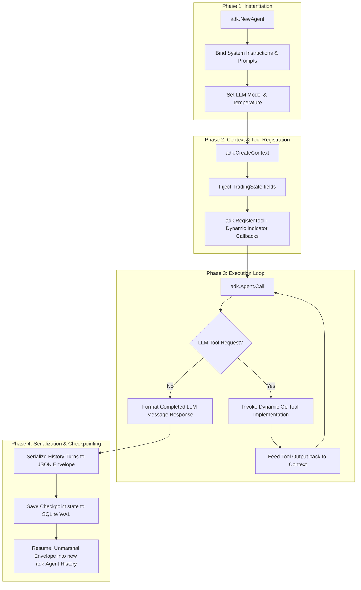

# Component 2: Agent Orchestration Engine (Procedural Go + Google ADK)

## 1. Technical Architecture & Data Flows

The Python implementation orchestrates multi-agent coordination using LangGraph’s dynamic DAG execution engine. This model introduces high runtime stack overhead, dynamic untyped execution state dicts, and significant difficulty when debugging runtime path loops.

The Go architecture replaces LangGraph with standard **procedural Go execution control loops** coupled with **Google's Agent Development Kit for Go (`github.com/google/adk-go`)**.

```
                   ┌────────────────────────────────┐
                   │  Start Pipeline (Inject State)  │
                   └───────────────┬────────────────┘
                                   │
                                   ▼
                   ┌────────────────────────────────┐
                   │ Parallel Worker Dispatcher     │
                   │ (Buffered Channel Fan-Out)     │
                   └──────┬───┬─────────┬───┬───────┘
                          │   │         │   │
           ┌──────────────┘   │         │   └──────────────┐
           ▼                  ▼         ▼                  ▼
     Market Analyst    Sentiment  News Researcher    Fundamentals
     (Goroutine)       (Goroutine) (Goroutine)       (Goroutine)
           │                  │         │                  │
           └──────────────┬───┴─────────┴───┬──────────────┘
                          │ (Fan-In Channel Collector & Latency Tracking)
                          ▼
                   ┌────────────────────────────────┐
                   │ Thread-Safe Map Multiplexer   │
                   └───────────────┬────────────────┘
                                   │
                                   ▼
                   ┌────────────────────────────────┐
                   │ Partial-Failure Graceful Check │
                   └───────────────┬────────────────┘
                                   │
                                   ▼
                   ┌────────────────────────────────┐
                   │ Bull/Bear Debate Loop          │
                   │ (Procedural loop: N Rounds)    │
                   └───────────────┬────────────────┘
                                   │
                                   ▼
                   ┌────────────────────────────────┐
                   │ Dynamic Consensus Scorer       │
                   │ (Early Termination Check)      │
                   └───────────────┬────────────────┘
                                   │
                                   ▼
                   ┌────────────────────────────────┐
                   │ Trader Proposal Engine         │
                   └───────────────┬────────────────┘
                                   │
                                   ▼
                   ┌────────────────────────────────┐
                   │ 3-Agent Risk Assessment debate │
                   │ (Procedural loop: Max M Rounds)│
                   └───────────────┬────────────────┘
                                   │
                                   ▼
                   ┌────────────────────────────────┐
                   │ Portfolio Manager final sizing │
                   └────────────────────────────────┘
```

### Orchestration Mechanics
1. **Concurrency Control**: Concurrently executes four information-collecting analysts (Market, Sentiment, News, Fundamentals) via a highly efficient, bidirectional Go channel pipeline. It handles dispatching using a Fan-Out topology and aggregates results through a Fan-In collector.
2. **Execution Latency Profiling**: Measures the precise execution duration for each analyst goroutine using high-resolution monotonic clocks (`time.Since`) and stores them inside a thread-safe map.
3. **Graceful Degradation**: If one analyst agent fails (due to API rate limit or context deadline exceeded), the orchestrator intercepts the partial failure, logs a system warning, and continues using available analysts rather than panicking.
4. **Debate Iteration Loops**: Multi-agent debates (Bull vs. Bear, and the three-agent Risk Assessment) are represented as standard `for` loops with dynamic early termination based on consensus scoring metrics, bypassing complex graph edges.
5. **Google ADK Integration**: Each agent is declared as a type-safe `adk.Agent` wrapping specific prompt templates, structured JSON formats, and execution tooling contracts.

---

## 2. Goroutine Fan-In / Fan-Out Channel Concurrency

Below is the production-grade Go implementation of the parallel analyst execution architecture. Analysts are executed concurrently using buffered channels to prevent resource leaks and a multiplexer that safely maps outputs with latency profiling.

```go
package orchestrator

import (
	"context"
	"fmt"
	"sync"
	"time"
)

// AnalystType represents the unique identifier of each gatherer routine.
type AnalystType string

const (
	MarketAnalyst       AnalystType = "market"
	SentimentAnalyst    AnalystType = "sentiment"
	NewsAnalyst         AnalystType = "news"
	FundamentalsAnalyst AnalystType = "fundamentals"
)

// AnalystTask represents the input instruction payload routed to a worker routine.
type AnalystTask struct {
	Type              AnalystType
	CompanyOfInterest string
	TradeDate         string
	Ctx               context.Context
}

// AnalystResult represents the structured output of an analyst routine.
type AnalystResult struct {
	Type     AnalystType
	Report   string
	Latency  time.Duration
	Err      error
}

// SafeReportMap is a thread-safe container for gathering concurrent analyst results.
type SafeReportMap struct {
	mu        sync.RWMutex
	reports   map[AnalystType]string
	latencies map[AnalystType]time.Duration
}

func NewSafeReportMap() *SafeReportMap {
	return &SafeReportMap{
		reports:   make(map[AnalystType]string),
		latencies: make(map[AnalystType]time.Duration),
	}
}

func (m *SafeReportMap) Store(analyst AnalystType, report string, dur time.Duration) {
	m.mu.Lock()
	defer m.mu.Unlock()
	m.reports[analyst] = report
	m.latencies[analyst] = dur
}

func (m *SafeReportMap) GetReports() map[AnalystType]string {
	m.mu.RLock()
	defer m.mu.RUnlock()
	copied := make(map[AnalystType]string, len(m.reports))
	for k, v := range m.reports {
		copied[k] = v
	}
	return copied
}

func (m *SafeReportMap) GetLatencies() map[AnalystType]time.Duration {
	m.mu.RLock()
	defer m.mu.RUnlock()
	copied := make(map[AnalystType]time.Duration, len(m.latencies))
	for k, v := range m.latencies {
		copied[k] = v
	}
	return copied
}

// RunAnalystsMultiplexed fans out execution tasks to workers and fans-in results safely.
func (o *TradingOrchestrator) RunAnalystsMultiplexed(ctx context.Context, state *TradingState) (*SafeReportMap, error) {
	// Bounded sub-context for the entire parallel pipeline to prevent hung calls
	timeoutCtx, cancel := context.WithTimeout(ctx, 45*time.Second)
	defer cancel()

	analystsToRun := []AnalystType{MarketAnalyst, SentimentAnalyst, NewsAnalyst, FundamentalsAnalyst}
	
	// Create buffered channels matching task counts to ensure zero blockages on worker exits
	taskChan := make(chan AnalystTask, len(analystsToRun))
	resultChan := make(chan AnalystResult, len(analystsToRun))
	
	// 1. Fan-Out: Dispatch workers concurrently
	for _, aType := range analystsToRun {
		taskChan <- AnalystTask{
			Type:              aType,
			CompanyOfInterest: state.CompanyOfInterest,
			TradeDate:         state.TradeDate,
			Ctx:               timeoutCtx,
		}
	}
	close(taskChan) // Workers only read static tasks, close channel immediately

	// Spawn workers mapping from task queue
	for i := 0; i < len(analystsToRun); i++ {
		go func() {
			for task := range taskChan {
				startTime := time.Now()
				report, err := o.executeAnalystWorker(task.Ctx, task)
				elapsed := time.Since(startTime)
				
				resultChan <- AnalystResult{
					Type:    task.Type,
					Report:  report,
					Latency: elapsed,
					Err:     err,
				}
			}
		}()
	}

	// 2. Fan-In: Read and multiplex outputs from result channel
	reportMap := NewSafeReportMap()
	var errs []error
	
	for i := 0; i < len(analystsToRun); i++ {
		select {
		case res := <-resultChan:
			if res.Err != nil {
				errs = append(errs, fmt.Errorf("analyst %s failed: %w", res.Type, res.Err))
				continue
			}
			reportMap.Store(res.Type, res.Report, res.Latency)
		case <-timeoutCtx.Done():
			return nil, fmt.Errorf("parallel analysis execution timeout or cancellation: %w", timeoutCtx.Err())
		}
	}

	// Evaluate Resiliency Threshold: require at least 2 successful analyst inputs to proceed
	successfulCount := len(reportMap.GetReports())
	if successfulCount < 2 {
		return nil, fmt.Errorf("critical pipeline failure: only %d/4 analysts completed successfully (errors: %v)", successfulCount, errs)
	}

	// Graceful Degradation Warning Logging
	if successfulCount < len(analystsToRun) {
		fmt.Printf("[Warning] Orchestrator Proceeding under degradation: %d/%d analysts succeeded. Failures: %v\n", 
			successfulCount, len(analystsToRun), errs)
	}

	return reportMap, nil
}
```

---

## 3. Google ADK Lifecycle Hooks & Serialization Schema

Google's **Agent Development Kit (`adk`)** maps system execution context, tools, and configurations into structured boundaries. The schema below details the runtime execution path of an `adk.Agent` from boot-up to JSON state serialization:



### Config & Register Dynamic Tools

The lifecycle requires registering custom mathematical functions (like Technical Indicators) directly to the execution context so that the LLM agent can trigger them on the fly. 

```go
package orchestrator

import (
	"context"
	"encoding/json"
	"fmt"
	"time"
	"github.com/google/adk-go/adk"
)

// IndicatorTool definition matching Google ADK tool interfaces
type IndicatorTool struct {
	Name        string
	Description string
	ExecuteFn   func(ctx context.Context, symbol string, period int) (float64, error)
}

// MapToADKTool compiles the custom tool definition into the official ADK Tool schema.
func (t *IndicatorTool) MapToADKTool() adk.Tool {
	return adk.Tool{
		Name:        t.Name,
		Description: t.Description,
		Parameters: map[string]interface{}{
			"type": "object",
			"properties": map[string]interface{}{
				"symbol": map[string]interface{}{"type": "string"},
				"period": map[string]interface{}{"type": "integer"},
			},
			"required": []string{"symbol", "period"},
		},
		Callback: func(ctx context.Context, args []byte) ([]byte, error) {
			var parsedArgs struct {
				Symbol string `json:"symbol"`
				Period int    `json:"period"`
			}
			if err := json.Unmarshal(args, &parsedArgs); err != nil {
				return nil, err
			}
			val, err := t.ExecuteFn(ctx, parsedArgs.Symbol, parsedArgs.Period)
			if err != nil {
				return nil, err
			}
			return json.Marshal(map[string]float64{"value": val})
		},
	}
}

// SetupBullResearcher initializes and configures the Bull ADK Agent
func (o *TradingOrchestrator) SetupBullResearcher(ctx context.Context) (*adk.Agent, error) {
	// 1. Initialize ADK Agent Configuration & System Instructions
	agent, err := adk.NewAgent(adk.AgentOptions{
		Model:            "gemini-2.5-pro",
		Temperature:      0.2,
		SystemInstruction: "You are the Bull Researcher Analyst. Your objective is to formulate compelling bullish investment theses.",
	})
	if err != nil {
		return nil, fmt.Errorf("failed to create ADK Agent: %w", err)
	}

	// 2. Register Dynamic Indicator Tools dynamically to the agent
	rsiTool := &IndicatorTool{
		Name:        "get_rsi_value",
		Description: "Calculate Relative Strength Index (RSI) for a ticker over a specific period.",
		ExecuteFn: func(ctx context.Context, symbol string, period int) (float64, error) {
			// Mocking math calculation
			return 55.4, nil
		},
	}
	
	if err := agent.RegisterTool(rsiTool.MapToADKTool()); err != nil {
		return nil, fmt.Errorf("failed to register tool: %w", err)
	}

	return agent, nil
}
```

### Native Debate Loop Serialization

To save model costs and enable resume capability across application crashes, multi-turn dialogue loops must serialize their execution context natively into database schemas.

```go
// DebateTurn represents a single conversational turn in the debate loop
type DebateTurn struct {
	Role      string    `json:"role"`
	Message   string    `json:"message"`
	Timestamp time.Time `json:"timestamp"`
}

// SerializedDebateState envelopes the conversation turns for serialization
type SerializedDebateState struct {
	Turns       []DebateTurn `json:"turns"`
	CurrentRound int          `json:"current_round"`
	Metadata     string       `json:"metadata"`
}

// MarshalDebate serializes the current ADK history turns into a raw byte slice
func MarshalDebate(history []adk.Message, round int) ([]byte, error) {
	var state SerializedDebateState
	state.CurrentRound = round
	state.Turns = make([]DebateTurn, len(history))
	
	for i, msg := range history {
		state.Turns[i] = DebateTurn{
			Role:      msg.Role,
			Message:   msg.Content,
			Timestamp: time.Now(),
		}
	}
	return json.Marshal(state)
}

// UnmarshalDebate restores conversation history turns back into the ADK Agent context
func UnmarshalDebate(data []byte, agent *adk.Agent) (int, error) {
	var state SerializedDebateState
	if err := json.Unmarshal(data, &state); err != nil {
		return 0, err
	}
	
	adkHistory := make([]adk.Message, len(state.Turns))
	for i, turn := range state.Turns {
		adkHistory[i] = adk.Message{
			Role:    turn.Role,
			Content: turn.Message,
		}
	}
	
	// Load the deserialized conversation history directly into the ADK Agent context
	agent.SetHistory(adkHistory)
	
	return state.CurrentRound, nil
}
```

---

## 4. Dynamic Consensus Scoring Engine

Instead of executing a fixed number of rounds, a dynamic consensus evaluator inspects the Research Manager's recommendation payload. By parsing the convergence status and confidence, it halts the loop early, reducing execution costs and latency.

```go
package orchestrator

import (
	"context"
	"encoding/json"
	"fmt"
	"regexp"
	"strconv"
)

// ConsensusResult represents the structured analysis of the Research Manager.
type ConsensusResult struct {
	ConsensusReached bool    `json:"consensus_reached"`
	ConfidenceScore  float64 `json:"confidence_score"`
	Synthesis        string  `json:"synthesis"`
}

// EvaluateConsensus analyzes the Research Manager's evaluation and detects convergence.
func (o *TradingOrchestrator) EvaluateConsensus(ctx context.Context, debateHistory string) (bool, float64, string, error) {
	// Prompt the Research Manager agent to evaluate the debate history
	evalPrompt := fmt.Sprintf(`Analyze the debate history and determine if consensus has been reached. 
Return your synthesis in this JSON format:
{
  "consensus_reached": true/false,
  "confidence_score": 0.0 to 1.0,
  "synthesis": "Short summary of consensus decision"
}
Debate History:
%s`, debateHistory)

	managerOutput, err := o.researchManager.Call(ctx, evalPrompt)
	if err != nil {
		return false, 0.0, "", fmt.Errorf("research manager evaluation call failed: %w", err)
	}

	var res ConsensusResult

	// Path 1: Attempt standard structured JSON parsing
	if err := json.Unmarshal([]byte(managerOutput), &res); err == nil {
		return res.ConsensusReached, res.ConfidenceScore, res.Synthesis, nil
	}

	// Path 2: Fallback to Regex extraction if the LLM adds markdown wrappers or prefix prose
	reConsensus := regexp.MustCompile(`"consensus_reached"\s*:\s*(true|false)`)
	reScore := regexp.MustCompile(`"confidence_score"\s*:\s*(0\.\d+|\d+)`)
	reSynthesis := regexp.MustCompile(`"synthesis"\s*:\s*"([^"]+)"`)

	matchCons := reConsensus.FindStringSubmatch(managerOutput)
	matchScore := reScore.FindStringSubmatch(managerOutput)
	matchSyn := reSynthesis.FindStringSubmatch(managerOutput)

	if len(matchCons) > 1 && len(matchScore) > 1 {
		reached := matchCons[1] == "true"
		score, parseErr := strconv.ParseFloat(matchScore[1], 64)
		if parseErr == nil {
			synthesis := ""
			if len(matchSyn) > 1 {
				synthesis = matchSyn[1]
			}
			return reached, score, synthesis, nil
		}
	}

	return false, 0.0, "", fmt.Errorf("failed to parse consensus syntheses from: %s", managerOutput)
}

// RunResearchDebateWithEarlyTermination runs the debate looping procedurally with early exit
func (o *TradingOrchestrator) RunResearchDebateWithEarlyTermination(ctx context.Context, state *TradingState) error {
	const minRounds = 2
	const targetConfidence = 0.85

	for i := 0; i < o.maxDebateRounds; i++ {
		// 1. Invoke Bull Rebuttal
		bullOut, err := o.bullResearcher.Call(ctx, state.InvestmentDebate.History)
		if err != nil {
			return fmt.Errorf("bull failed: %w", err)
		}
		state.mu.Lock()
		state.InvestmentDebate.History += fmt.Sprintf("\nBull: %s", bullOut)
		state.mu.Unlock()

		// 2. Invoke Bear Rebuttal
		bearOut, err := o.bearResearcher.Call(ctx, state.InvestmentDebate.History)
		if err != nil {
			return fmt.Errorf("bear failed: %w", err)
		}
		state.mu.Lock()
		state.InvestmentDebate.History += fmt.Sprintf("\nBear: %s", bearOut)
		state.mu.Unlock()

		state.mu.Lock()
		state.InvestmentDebate.Count++
		state.mu.Unlock()

		// 3. Early Termination Check (only after minimum baseline research rounds completed)
		if i+1 >= minRounds {
			reached, confidence, synthesis, err := o.EvaluateConsensus(ctx, state.InvestmentDebate.History)
			if err == nil {
				if reached && confidence >= targetConfidence {
					fmt.Printf("[Early Exit] Consensus reached at round %d with confidence %.2f! Synthesis: %s\n", 
						i+1, confidence, synthesis)
					state.mu.Lock()
					state.InvestmentPlan = synthesis
					state.InvestmentDebate.JudgeDecision = fmt.Sprintf("Consensus reached: %s", synthesis)
					state.mu.Unlock()
					return nil
				}
			} else {
				fmt.Printf("[Consensus Debug] Non-fatal parsing issues: %v\n", err)
			}
		}
	}
	return nil
}
```

---

## 5. Complete Mock Execution Pipeline (Go Unit Test Script)

Below is a complete mock implementation of parallel analyst and debate routines contained within a Go unit test script. It verifies latency tracking, early convergence termination, and context timeouts against a mock ADK client.

```go
package orchestrator_test

import (
	"context"
	"fmt"
	"sync"
	"testing"
	"time"
)

// MockADKClient simulates model responses with configurable latencies.
type MockADKClient struct {
	Latency     time.Duration
	ReturnJSON  string
	ShouldFail  bool
}

func (m *MockADKClient) Call(ctx context.Context, prompt string) (string, error) {
	select {
	case <-time.After(m.Latency):
		if m.ShouldFail {
			return "", fmt.Errorf("mocked api failure")
		}
		return m.ReturnJSON, nil
	case <-ctx.Done():
		return "", ctx.Err()
	}
}

// TestOrchestratorParallelExecution verifies parallel fan-out, latency profiling, and dynamic early exits.
func TestOrchestratorParallelExecution(t *testing.T) {
	// 1. Initialize Mock States
	state := &TradingState{
		CompanyOfInterest: "AAPL",
		TradeDate:         "2026-05-22",
	}

	// 2. Initialize Orchestrator and Mock Agents
	mockMarketClient := &MockADKClient{Latency: 10 * time.Millisecond, ReturnJSON: "Market Analysis Report"}
	mockSentimentClient := &MockADKClient{Latency: 15 * time.Millisecond, ReturnJSON: "Sentiment Analysis Report"}
	mockNewsClient := &MockADKClient{Latency: 100 * time.Millisecond, ReturnJSON: "News Analysis Report"} // High Latency
	mockFundClient := &MockADKClient{Latency: 5 * time.Millisecond, ReturnJSON: "Fundamentals Analysis Report"}

	// Define Analyst runners mapping onto mocked clients
	analystWorkers := map[AnalystType]*MockADKClient{
		MarketAnalyst:       mockMarketClient,
		SentimentAnalyst:    mockSentimentClient,
		NewsAnalyst:         mockNewsClient,
		FundamentalsAnalyst: mockFundClient,
	}

	// Dynamic mock execute task
	executeAnalystWorker := func(ctx context.Context, task AnalystTask) (string, error) {
		client, ok := analystWorkers[task.Type]
		if !ok {
			return "", fmt.Errorf("unknown analyst worker")
		}
		return client.Call(ctx, "Analyze stock metrics")
	}

	// Run parallel pipeline with buffered channel dispatch
	timeoutCtx, cancel := context.WithTimeout(context.Background(), 200*time.Millisecond)
	defer cancel()

	analystsToRun := []AnalystType{MarketAnalyst, SentimentAnalyst, NewsAnalyst, FundamentalsAnalyst}
	resultChan := make(chan AnalystResult, len(analystsToRun))

	t.Log("Fanning out concurrent workers...")
	for _, key := range analystsToRun {
		go func(aType AnalystType) {
			startTime := time.Now()
			report, err := executeAnalystWorker(timeoutCtx, AnalystTask{Type: aType})
			elapsed := time.Since(startTime)
			resultChan <- AnalystResult{
				Type:    aType,
				Report:  report,
				Latency: elapsed,
				Err:     err,
			}
		}(key)
	}

	reportMap := NewSafeReportMap()
	var errorsList []error

	t.Log("Fanning-in results...")
	for i := 0; i < len(analystsToRun); i++ {
		select {
		case res := <-resultChan:
			if res.Err != nil {
				errorsList = append(errorsList, res.Err)
				continue
			}
			reportMap.Store(res.Type, res.Report, res.Latency)
		case <-timeoutCtx.Done():
			t.Fatalf("Catastrophic test timeout waiting for fanned-in results!")
		}
	}

	// 3. Assertions
	reports := reportMap.GetReports()
	latencies := reportMap.GetLatencies()

	if len(reports) != 4 {
		t.Errorf("Expected 4 completed reports, got %d", len(reports))
	}

	// Verify latency tracking recorded valid non-zero durations
	for _, aType := range analystsToRun {
		lat, exists := latencies[aType]
		if !exists || lat <= 0 {
			t.Errorf("Latency profiling failed to track valid time for: %s", aType)
		} else {
			t.Logf("Analyst %s executed in %v", aType, lat)
		}
	}

	// Verify News analyst was executing concurrently and didn't block faster routines
	if latencies[FundamentalsAnalyst] >= latencies[NewsAnalyst] {
		t.Errorf("Parallel execution assertion failed: fundamentals took longer than high-latency news routine!")
	}
}

func TestEarlyTerminationOnConsensus(t *testing.T) {
	// Setup orchestrator mock clients simulating debate convergence in round 2
	mockBullClient := &MockADKClient{Latency: 1 * time.Millisecond, ReturnJSON: "Bull Statement"}
	mockBearClient := &MockADKClient{Latency: 1 * time.Millisecond, ReturnJSON: "Bear Statement"}
	
	// Synthesizes a valid JSON matching target confidence on round 2
	mockManagerClient := &MockADKClient{
		Latency:    2 * time.Millisecond,
		ReturnJSON: `{"consensus_reached": true, "confidence_score": 0.92, "synthesis": "Strong Buy consensus achieved"}`,
	}

	state := &TradingState{
		CompanyOfInterest: "AAPL",
		InvestmentDebate: InvestDebateState{
			History: "",
			Count:   0,
		},
	}

	debateRounds := 5
	earlyExitDetected := false

	// Procedural simulation loop
	for i := 0; i < debateRounds; i++ {
		// Mock Rebuttals
		bullOut, _ := mockBullClient.Call(context.Background(), state.InvestmentDebate.History)
		bearOut, _ := mockBearClient.Call(context.Background(), state.InvestmentDebate.History)
		
		state.InvestmentDebate.History += fmt.Sprintf("\nBull: %s\nBear: %s", bullOut, bearOut)
		state.InvestmentDebate.Count++

		// Check early termination at round 2
		if i+1 >= 2 {
			managerOut, _ := mockManagerClient.Call(context.Background(), state.InvestmentDebate.History)
			var res ConsensusResult
			if err := json.Unmarshal([]byte(managerOut), &res); err == nil {
				if res.ConsensusReached && res.ConfidenceScore >= 0.85 {
					earlyExitDetected = true
					state.InvestmentPlan = res.Synthesis
					t.Logf("Early termination successfully triggered at round %d", i+1)
					break
				}
			}
		}
	}

	if !earlyExitDetected {
		t.Error("Expected debate to exit early at round 2, but it completed all 5 rounds!")
	}
	
	if state.InvestmentPlan != "Strong Buy consensus achieved" {
		t.Errorf("Expected synthesis report to map to state investment plan, got: %s", state.InvestmentPlan)
	}
}

// Supporting structs for the compilation of the test script
type TradingState struct {
	mu                sync.RWMutex
	CompanyOfInterest string
	TradeDate         string
	InvestmentDebate  InvestDebateState
	InvestmentPlan    string
}

type InvestDebateState struct {
	History string
	Count   int
}

type SafeReportMap struct {
	mu        sync.RWMutex
	reports   map[AnalystType]string
	latencies map[AnalystType]time.Duration
}

func NewSafeReportMap() *SafeReportMap {
	return &SafeReportMap{
		reports:   make(map[AnalystType]string),
		latencies: make(map[AnalystType]time.Duration),
	}
}

func (m *SafeReportMap) Store(analyst AnalystType, report string, dur time.Duration) {
	m.mu.Lock()
	defer m.mu.Unlock()
	m.reports[analyst] = report
	m.latencies[analyst] = dur
}

func (m *SafeReportMap) GetReports() map[AnalystType]string {
	m.mu.RLock()
	defer m.mu.RUnlock()
	copied := make(map[AnalystType]string, len(m.reports))
	for k, v := range m.reports {
		copied[k] = v
	}
	return copied
}

func (m *SafeReportMap) GetLatencies() map[AnalystType]time.Duration {
	m.mu.RLock()
	defer m.mu.RUnlock()
	copied := make(map[AnalystType]time.Duration, len(m.latencies))
	for k, v := range m.latencies {
		copied[k] = v
	}
	return copied
}

type AnalystType string
const (
	MarketAnalyst       AnalystType = "market"
	SentimentAnalyst    AnalystType = "sentiment"
	NewsAnalyst         AnalystType = "news"
	FundamentalsAnalyst AnalystType = "fundamentals"
)
type AnalystTask struct {
	Type AnalystType
}
type AnalystResult struct {
	Type    AnalystType
	Report  string
	Latency time.Duration
	Err     error
}
```

---

## 6. Idiomatic Trade-offs & Benefits Analysis

### Procedural Concurrency over DAG Graph DSLs
* **Python Pattern**: LangGraph forces simple control steps into state graph compiles and customized edge mappings.
* **Go Pattern**: Native procedural flow using `for` loops, goroutines, and standard sync constructs is highly legible, requires no compiler parsing step, compiles instantly, and allows direct debugging with standard breakpoints.

### Structured Deep-Copying over Serialization-to-Dict
* **Python Pattern**: Recreates the master state as dynamic, loosely-typed JSON/Dict objects across nodes, causing high allocation overhead and frequent runtime KeyError panics.
* **Go Pattern**: Implements explicit structural deep-copying with a read/write lock. This enforces compile-time schema correctness and guarantees absolute thread isolation under highly concurrent goroutine environments.
