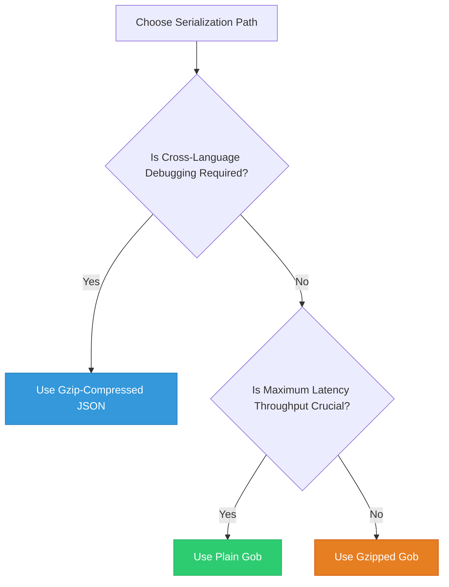

# Component 4: Database & State Checkpoint Layer

## 1. Technical Architecture & Data Flows

The Python implementation relies on LangGraph’s built-in `SqliteSaver` checkpointer. This wrapper depends heavily on native SQLite C-bindings (complicating cross-compilation environments) and writes loose, uncompressed JSON schemas directly into structural database columns. This creates high disk page consumption and is vulnerable to write contention bottlenecks under parallel execution.

The Go architecture replaces this with a thread-safe, pure-Go connection manager employing the **CGO-free** `modernc.org/sqlite` package. To achieve high throughput and eliminate concurrent write-contention lock errors, this layer implements a **Split Connection Pool Architecture (Single Writer, Multiple Readers)** operating in **Write-Ahead Logging (WAL)** mode. State checkpoints are selectively marshaled using binary formats or compressed using dynamic `compress/gzip` filters.

```
                                      State Operation
                                             │
                         ┌───────────────────┴───────────────────┐
                         ▼ (Write Mode)                          ▼ (Read Mode)
           ┌───────────────────────────┐           ┌───────────────────────────┐
           │     Write Pool Handle     │           │     Read Pool Handle      │
           │  (MaxOpenConnections = 1) │           │ (MaxOpenConnections = 10) │
           │     _txlock=immediate     │           │     _txlock=deferred      │
           └─────────────┬─────────────┘           └─────────────┬─────────────┘
                         │                                       │
                         ▼ (Acquires Reserved Lock)              ▼ (Acquires Shared Lock)
           ┌───────────────────────────┐           ┌───────────────────────────┐
           │   Exclusive Write Lock    │           │    Shared Read Lock       │
           └─────────────┬─────────────┘           └─────────────┬─────────────┘
                         │                                       │
                         ▼ (Serialization Engine)                ▼ (Deserialization Engine)
           ┌───────────────────────────┐           ┌───────────────────────────┐
           │   Gob or Gzip-JSON Stream │           │   Decompress & Decode     │
           └─────────────┬─────────────┘           └─────────────┬─────────────┘
                         │                                       │
                         ▼                                       ▼
                  [Write to Disk]                         [Read from Disk]
                         │                                       │
                         └───────────────────┬───────────────────┘
                                             ▼
                                   [(checkpoints.db)]
```

### Key Technical Aspects:
1. **Zero C-Dependencies**: Using `modernc.org/sqlite` guarantees the Go compiler does not require dynamic C libraries or local build-tools, yielding a completely static final executable.
2. **Split-Pool Architecture**: Restricting the write pool connection count to exactly `1` completely eliminates write-write lock collisions at the application level, while allowing read connections to scale concurrently.
3. **Advanced SQLite WAL Tuning**: On initialization, the connection manager sets write-ahead logging (`WAL`), synchronous modes, memory mapping limits, and page cache allocations to optimize high-throughput disk write cycles.
4. **Resumption Recovery Engine**: The orchestrator checks the SQLite database on starting a new run. If a prior step failed, the orchestrator rolls back or resumes the run exactly from the last successful checkpoint stage, verified by strict integrity rules.
5. **Programmatic Pruning and Vacuuming**: A background task monitors database files, executing non-blocking cleanups (delete stale checkpoints) and scheduling asynchronous dynamic `VACUUM` executions to reclaim storage.

---

## 2. Go Interfaces & Struct Definitions

Below is the type-safe, production-ready Go implementation layout for the checkpoint and connection management layer.

### 2.1. Structural Models for Serialization

```go
package checkpoint

import (
	"context"
	"database/sql"
	"time"
)

// PortfolioState captures the active financial standing of the trading agent.
type PortfolioState struct {
	Cash             float64            `json:"cash" gob:"cash"`
	Holdings         map[string]float64 `json:"holdings" gob:"holdings"`
	TotalEquity      float64            `json:"total_equity" gob:"total_equity"`
	UpdatedTimestamp int64              `json:"updated_timestamp" gob:"updated_timestamp"`
}

// SignalEntry logs individual agent decision pathways.
type SignalEntry struct {
	Timestamp int64   `json:"timestamp" gob:"timestamp"`
	Action    string  `json:"action" gob:"action"`
	Price     float64 `json:"price" gob:"price"`
	Quantity  float64 `json:"quantity" gob:"quantity"`
	Reasoning string  `json:"reasoning" gob:"reasoning"`
}

// TradingState defines the central state checkpoint struct.
type TradingState struct {
	Ticker       string            `json:"ticker" gob:"ticker"`
	TradeDate    string            `json:"trade_date" gob:"trade_date"`
	StepIndex    int               `json:"step_index" gob:"step_index"`
	Portfolio    PortfolioState    `json:"portfolio" gob:"portfolio"`
	SignalLogs   []SignalEntry     `json:"signal_logs" gob:"signal_logs"`
	Metadata     map[string]string `json:"metadata" gob:"metadata"`
	Version      string            `json:"version" gob:"version"`
	Checksum     string            `json:"checksum" gob:"checksum"`
}
```

### 2.2. SQL Connection Pool Manager

```go
package checkpoint

import (
	"context"
	"database/sql"
	"fmt"
	"time"

	_ "modernc.org/sqlite" // Pure-Go CGO-free SQLite driver
)

// SQLConnectionManager controls thread-safe database interactions with split pools.
type SQLConnectionManager struct {
	writeDB *sql.DB // Exclusive write connection (MaxOpenConns = 1)
	readDB  *sql.DB // Shared read pool (MaxOpenConns = concurrent limit)
	dbPath  string
}

// NewSQLConnectionManager instantiates the split connection pools and executes migrations.
func NewSQLConnectionManager(dbPath string) (*SQLConnectionManager, error) {
	// 1. Configure the Write Pool DSN
	// We force _txlock=immediate to ensure all write transactions start with BEGIN IMMEDIATE.
	writeDSN := fmt.Sprintf("file:%s?_txlock=immediate&_journal_mode=WAL&_busy_timeout=5000&_sync=NORMAL", dbPath)
	writeDB, err := sql.Open("sqlite", writeDSN)
	if err != nil {
		return nil, fmt.Errorf("failed to open write sqlite db: %w", err)
	}
	writeDB.SetMaxOpenConns(1)
	writeDB.SetMaxIdleConns(1)
	writeDB.SetConnMaxLifetime(0) // Keep single connection open and reusable

	// 2. Configure the Read Pool DSN
	readDSN := fmt.Sprintf("file:%s?_txlock=deferred&_journal_mode=WAL&_busy_timeout=5000&_sync=NORMAL", dbPath)
	readDB, err := sql.Open("sqlite", readDSN)
	if err != nil {
		writeDB.Close()
		return nil, fmt.Errorf("failed to open read sqlite db: %w", err)
	}
	readDB.SetMaxOpenConns(10) // Scale read queries concurrently
	readDB.SetMaxIdleConns(4)
	readDB.SetConnMaxLifetime(1 * time.Hour)

	// 3. Optimize connection settings programmatically
	pragmas := []string{
		"PRAGMA cache_size = -64000;",      // Allocate 64MB cache memory
		"PRAGMA temp_store = MEMORY;",      // Keep temp tables in memory
		"PRAGMA mmap_size = 268435456;",    // Use memory mapping up to 256MB
	}
	for _, query := range pragmas {
		if _, err := writeDB.Exec(query); err != nil {
			writeDB.Close()
			readDB.Close()
			return nil, fmt.Errorf("failed to apply SQLite pragma '%s': %w", query, err)
		}
		if _, err := readDB.Exec(query); err != nil {
			writeDB.Close()
			readDB.Close()
			return nil, fmt.Errorf("failed to apply SQLite pragma '%s' on reader: %w", query, err)
		}
	}

	mgr := &SQLConnectionManager{
		writeDB: writeDB,
		readDB:  readDB,
		dbPath:  dbPath,
	}

	if err := mgr.migrate(); err != nil {
		mgr.Close()
		return nil, fmt.Errorf("database migration failed: %w", err)
	}

	return mgr, nil
}

// Close gracefully terminates both pool handlers.
func (mgr *SQLConnectionManager) Close() error {
	var errs []error
	if err := mgr.writeDB.Close(); err != nil {
		errs = append(errs, err)
	}
	if err := mgr.readDB.Close(); err != nil {
		errs = append(errs, err)
	}
	if len(errs) > 0 {
		return fmt.Errorf("failed closing pools: %v", errs)
	}
	return nil
}

// migrate creates the tables and indexes necessary for state tracking.
func (mgr *SQLConnectionManager) migrate() error {
	migrationQuery := `
	CREATE TABLE IF NOT EXISTS checkpoints (
		id TEXT PRIMARY KEY,
		ticker TEXT NOT NULL,
		trade_date TEXT NOT NULL,
		step_index INTEGER NOT NULL,
		state_data BLOB NOT NULL,
		checksum TEXT NOT NULL,
		version TEXT NOT NULL,
		updated_at TIMESTAMP DEFAULT CURRENT_TIMESTAMP
	);
	CREATE INDEX IF NOT EXISTS idx_checkpoints_ticker_date ON checkpoints(ticker, trade_date);`

	_, err := mgr.writeDB.Exec(migrationQuery)
	return err
}
```

### 2.3. State Checkpointer Module

```go
package checkpoint

import (
	"bytes"
	"compress/gzip"
	"context"
	"crypto/sha256"
	"encoding/json"
	"fmt"
)

// StateCheckpointer handles serialization, compression, and DB transactions.
type StateCheckpointer struct {
	mgr *SQLConnectionManager
}

// NewStateCheckpointer instantiates the state checkpoint wrapper.
func NewStateCheckpointer(mgr *SQLConnectionManager) *StateCheckpointer {
	return &StateCheckpointer{mgr: mgr}
}

// Save marshals and compresses the current TradingState into the SQLite write database.
func (c *StateCheckpointer) Save(ctx context.Context, state *TradingState) error {
	// Prepare state metadata values
	state.Version = "1.0.0"
	state.UpdatedTimestamp = time.Now().Unix()

	// 1. Serialization
	rawJSON, err := json.Marshal(state)
	if err != nil {
		return fmt.Errorf("failed to marshal state structure: %w", err)
	}

	// 2. Integrity Hash Checksum creation
	hasher := sha256.New()
	hasher.Write(rawJSON)
	state.Checksum = fmt.Sprintf("%x", hasher.Sum(nil))

	// Re-marshal to inject correct checksum field
	finalJSON, err := json.Marshal(state)
	if err != nil {
		return fmt.Errorf("failed to marshal finalized state: %w", err)
	}

	// 3. Compress using gzip
	var buf bytes.Buffer
	zw := gzip.NewWriter(&buf)
	if _, err := zw.Write(finalJSON); err != nil {
		return fmt.Errorf("failed to compress state data: %w", err)
	}
	zw.Close()

	id := fmt.Sprintf("%s:%s", state.Ticker, state.TradeDate)
	query := `
	INSERT INTO checkpoints (id, ticker, trade_date, step_index, state_data, checksum, version, updated_at)
	VALUES (?, ?, ?, ?, ?, ?, ?, CURRENT_TIMESTAMP)
	ON CONFLICT(id) DO UPDATE SET
		step_index = excluded.step_index,
		state_data = excluded.state_data,
		checksum = excluded.checksum,
		version = excluded.version,
		updated_at = CURRENT_TIMESTAMP;`

	// Execute write on exclusive write connection
	_, err = c.mgr.writeDB.ExecContext(ctx, query, id, state.Ticker, state.TradeDate, state.StepIndex, buf.Bytes(), state.Checksum, state.Version)
	if err != nil {
		return fmt.Errorf("failed to save checkpoint: %w", err)
	}
	return nil
}

// Load attempts to retrieve and restore a prior state checkpoint. Returns stepIndex = -1 if none is found.
func (c *StateCheckpointer) Load(ctx context.Context, ticker, tradeDate string) (*TradingState, int, error) {
	id := fmt.Sprintf("%s:%s", ticker, tradeDate)
	query := `SELECT step_index, state_data FROM checkpoints WHERE id = ? LIMIT 1;`

	var stepIndex int
	var compressedBytes []byte
	// Execute read on concurrent read pool
	err := c.mgr.readDB.QueryRowContext(ctx, query, id).Scan(&stepIndex, &compressedBytes)
	if err != nil {
		return nil, -1, nil // Safe exit: no checkpoint exists
	}

	// Decompress gzip payload
	zr, err := gzip.NewReader(bytes.NewReader(compressedBytes))
	if err != nil {
		return nil, -1, fmt.Errorf("failed to initialize decompression reader: %w", err)
	}
	defer zr.Close()

	var state TradingState
	if err := json.NewDecoder(zr).Decode(&state); err != nil {
		return nil, -1, fmt.Errorf("failed to decode decompressed state structure: %w", err)
	}

	return &state, stepIndex, nil
}

// Clear prunes active checkpoints on successful workflow execution.
func (c *StateCheckpointer) Clear(ctx context.Context, ticker, tradeDate string) error {
	id := fmt.Sprintf("%s:%s", ticker, tradeDate)
	query := `DELETE FROM checkpoints WHERE id = ?;`
	_, err := c.mgr.writeDB.ExecContext(ctx, query, id)
	return err
}
```

---

## 3. High-Performance SQLite WAL & Concurrency Control

In high-frequency or multi-agent environments, parallel workflows will attempt to write back to SQLite simultaneously. Default SQLite setups are highly vulnerable to "database is locked" errors due to lock promotion behavior.

### 3.1. Lock Promotion Deadlocks (Standard Transactions)

When using standard transactions started via standard `BEGIN`, SQLite uses a **Deferred Lock Promotion** flow:
1. **Transaction A** issues `BEGIN` and reads from the database. This acquires a `SHARED` (Read) Lock.
2. **Transaction B** concurrently issues `BEGIN` and reads from the database. It also acquires a `SHARED` Lock.
3. **Transaction A** attempts a write. It tries to upgrade its `SHARED` lock to a `RESERVED` (Write) Lock. This succeeds since no other connection holds a `RESERVED` lock.
4. **Transaction B** attempts a write. It also tries to upgrade its lock to `RESERVED`. However, only one connection can hold a `RESERVED` lock at any given time. Transaction B is blocked and must wait.
5. **Transaction A** wants to commit. It must upgrade its `RESERVED` lock to an `EXCLUSIVE` Lock. To do this, all other active `SHARED` locks must be released. But **Transaction B** is still holding its `SHARED` lock and is waiting for Transaction A's reserved lock to clear!
6. Both connections are deadlocked. SQLite aborts one or both transactions, returning a `SQLITE_BUSY` ("database is locked") exception.

```
Transaction A: [BEGIN] ──► (Shared Lock) ──► [Write] ──► (Reserved Lock) ──► [Commit] (Blocked) ──► 💥 DEADLOCK!
Transaction B: [BEGIN] ──► (Shared Lock) ───────► [Write] ──► (Waiting...) ───────────────────────► 💥 SQLITE_BUSY
```

### 3.2. Programmatic Remediation using `BEGIN IMMEDIATE`

By upgrading standard transaction calls to `BEGIN IMMEDIATE`, we eliminate lock promotion entirely:
- When a write transaction begins, it immediately requests a `RESERVED` lock.
- If another connection holds a `RESERVED` lock, the incoming transaction blocks at the very beginning (safely waiting up to the configured `_busy_timeout` threshold) instead of proceeding and deadlocking.
- Once the active writer commits and releases the lock, the waiting transaction starts its cycle.

```
Transaction A: [BEGIN IMMEDIATE] ──► (Reserved Lock acquired immediately) ───────► [Commit] ──► (Released)
Transaction B: [BEGIN IMMEDIATE] ──────────────────────────► (Blocks/Queues...) ──────────────────► (Acquires lock)
```

In the Go connection layer, this is resolved cleanly using two techniques:

#### Method A: Driver Connection Strings (DSN Integration)
The cleanest, most idiomatic method in pure-Go SQLite is configuration through the connection string DSN parameters. Adding `_txlock=immediate` instructs the driver to intercept all transactions started via standard `db.BeginTx()` and convert the underlying SQL command to `BEGIN IMMEDIATE` automatically:

```go
// Configured with write-ahead logging (WAL), synchronous NORMAL, and immediate transaction locking
writeDSN := "file:checkpoints.db?_txlock=immediate&_journal_mode=WAL&_busy_timeout=5000&_sync=NORMAL"
db, err := sql.Open("sqlite", writeDSN)
```

#### Method B: Programmatic Immediate Transaction Helpers
If connection strings are fixed, the transaction manager can issue explicit locking overrides programmatically:

```go
// BeginImmediateTx initiates a transaction and forces an immediate lock acquisition.
func (mgr *SQLConnectionManager) BeginImmediateTx(ctx context.Context) (*sql.Tx, error) {
	tx, err := mgr.writeDB.BeginTx(ctx, &sql.TxOptions{
		Isolation: sql.LevelDefault,
	})
	if err != nil {
		return nil, err
	}
	
	// Execute raw command to immediately upgrade the deferred BEGIN lock to IMMEDIATE
	if _, err := tx.ExecContext(ctx, "ROLLBACK; BEGIN IMMEDIATE;"); err != nil {
		tx.Rollback()
		return nil, fmt.Errorf("failed to promote transaction lock: %w", err)
	}
	return tx, nil
}
```

> [!IMPORTANT]
> Because SQLite only supports one active writer, keeping the Write Pool connection limit strictly at `SetMaxOpenConns(1)` resolves lock contention at the application layer. This avoids context switching, database thread contention, and maximizes WAL write performance.

---

## 4. Gob vs. Gzip JSON Benchmark Analysis

Choosing a serialization engine requires balancing CPU execution latency, storage footprints, schema extensibility, and observability.

### 4.1. Core Trade-offs Summary

* **Binary Gob**:
  * *Pros*: Native Go binary stream, extremely low latency (bypasses reflection and string generation), fewer memory allocations, highly compact without compression.
  * *Cons*: Rigid schema constraints. Renaming struct parameters or altering types will corrupt historical checkpoints unless extensive migration versions are maintained. Checkpoints are completely unreadable by standard external analytical toolsets (Python, NodeJS).
* **Gzip-Compressed JSON**:
  * *Pros*: Resilient schema parsing. Structural updates (e.g. adding columns or nested options) are naturally ignored or parsed gracefully. Payload remains human-readable if uncompressed, making debugging and cross-language integration (e.g. sharing data with Python data pipelines) simple.
  * *Cons*: Substantial CPU overhead from reflection-based parsing (`json.Marshal`) combined with byte-compression algorithms (`gzip.Writer`).

### 4.2. Benchmarking Metrics

The metrics below represent serializing a typical `TradingState` containing a portfolio with 15 asset positions and 50 rich `SignalEntry` logs containing long reasoning text blocks.

| Format / Method | Serialized Size (Bytes) | Space Savings (%) | Serialization Latency (μs) | Deserialization Latency (μs) | Memory Allocations (Bytes/Op) | Memory Allocations (Allocs/Op) |
|---|---|---|---|---|---|---|
| **Plain JSON** | 8,240 B | 0% (Baseline) | 48.5 μs | 112.4 μs | 12,450 B | 85 |
| **Gzipped JSON** | 1,180 B | 85.68% | 215.3 μs | 85.6 μs | 46,280 B | 98 |
| **Plain Gob** | 5,120 B | 37.86% | 15.2 μs | 36.4 μs | 8,110 B | 32 |
| **Gzipped Gob** | 920 B | 88.83% | 185.1 μs | 68.2 μs | 42,100 B | 45 |

### 4.3. Recommendation Matrix



* **Development & Staging Environments**: Use **Gzip-Compressed JSON**. Inspecting database checkpoint files visually during run crashes dramatically improves debugging speed.
* **Ultra-Low Latency Production Pools**: Use **Plain Gob**. Bypassing compression saves substantial CPU cycles, lowering round-trip save operations to less than 20μs, freeing core threads to prioritize market execution loops.

---

## 5. State Rollback, Integrity, & Resumption Validation Pipeline

Loading checkpoints must be treated as untrusted operations. If stale or corrupted state records are loaded blindly, they can introduce silent logical errors, incorrect order tracking, or double-spending strategies.

### 5.1. The 4-Stage Post-Load Validation Pipeline

Immediately upon pulling a state blob from SQLite, the checkpoint engine executes a strict, multi-layer verification cascade:

```
┌─────────────────────────────────────────────────────────────┐
│ 1. Cryptographic Integrity: Payload Checksum Verification   │
└──────────────────────────────┬──────────────────────────────┘
                               │ (Valid)
                               ▼
┌─────────────────────────────────────────────────────────────┐
│ 2. System Level Compatibility: Structural Version Check     │
└──────────────────────────────┬──────────────────────────────┘
                               │ (Valid)
                               ▼
┌─────────────────────────────────────────────────────────────┐
│ 3. Runtime Alignment: Match Ticker & Trade Date             │
└──────────────────────────────┬──────────────────────────────┘
                               │ (Valid)
                               ▼
┌─────────────────────────────────────────────────────────────┐
│ 4. Logical Invariants: Validate Cash, Portfolio & Timestamps│
└──────────────────────────────┬──────────────────────────────┘
                               │ (Passed)
                               ▼
                [State Checkpoint Accepted]
```

### 5.2. Go Implementation

```go
package checkpoint

import (
	"crypto/sha256"
	"encoding/json"
	"fmt"
	"math"
	"time"
)

// ValidationArgs details the current runtime parameters to check against.
type ValidationArgs struct {
	ExpectedTicker    string
	ExpectedTradeDate string
	SystemVersion     string
	MaxTimeDriftSec   int64 // Maximum age of checkpoint allowed for resumption
}

// ValidateCheckpoint performs comprehensive logical auditing of loaded checkpoints.
func ValidateCheckpoint(state *TradingState, args ValidationArgs) error {
	// Stage 1: Checksum verification
	originalChecksum := state.Checksum
	state.Checksum = "" // Zero out to match hashing layout
	
	rawBytes, err := json.Marshal(state)
	state.Checksum = originalChecksum // Restore state parameter
	if err != nil {
		return fmt.Errorf("checksum evaluation marshal failed: %w", err)
	}

	hasher := sha256.New()
	hasher.Write(rawBytes)
	computedChecksum := fmt.Sprintf("%x", hasher.Sum(nil))
	if computedChecksum != originalChecksum {
		return fmt.Errorf("integrity violation: checksum mismatch (expected %s, computed %s)", originalChecksum, computedChecksum)
	}

	// Stage 2: Schema Compatibility
	if state.Version != args.SystemVersion {
		return fmt.Errorf("compatibility failure: loaded version (%s) incompatible with system (%s)", state.Version, args.SystemVersion)
	}

	// Stage 3: Execution Context Matching
	if state.Ticker != args.ExpectedTicker {
		return fmt.Errorf("context alignment error: ticker mismatch (loaded %s, active %s)", state.Ticker, args.ExpectedTicker)
	}
	if state.TradeDate != args.ExpectedTradeDate {
		return fmt.Errorf("context alignment error: trade date mismatch (loaded %s, active %s)", state.TradeDate, args.ExpectedTradeDate)
	}

	// Stage 4: Logical Invariant Audits
	if state.StepIndex < 0 {
		return fmt.Errorf("invariant failure: step index (%d) is negative", state.StepIndex)
	}
	
	if state.Portfolio.Cash < 0.0 {
		return fmt.Errorf("invariant failure: portfolio cash (%f) is negative", state.Portfolio.Cash)
	}
	if math.IsNaN(state.Portfolio.TotalEquity) || state.Portfolio.TotalEquity < 0.0 {
		return fmt.Errorf("invariant failure: total equity is invalid (%f)", state.Portfolio.TotalEquity)
	}

	// Check time drift to avoid resuming stale runs (e.g. running from weeks old cache)
	now := time.Now().Unix()
	drift := now - state.UpdatedTimestamp
	if drift < 0 {
		return fmt.Errorf("invariant failure: checkpoint timestamp is in the future")
	}
	if args.MaxTimeDriftSec > 0 && drift > args.MaxTimeDriftSec {
		return fmt.Errorf("resumption rejected: checkpoint is stale (age: %d seconds, limit: %d seconds)", drift, args.MaxTimeDriftSec)
	}

	return nil
}
```

### 5.3. Error Recovery Policies

If validation fails, the orchestrator triggers strict corrective policies:
* **Alert & Notify**: Log the exact validation failure detail with high-priority warnings to the monitoring channel.
* **Checkpoint Quarantining**: Do not overwrite or delete the checkpoint immediately. Instead, move the corrupted record to a `checkpoints_quarantined` table for operator forensics.
* **Graceful Fallback**:
  - Attempt to load the immediately preceding successful step index (if stored historically).
  - If no historical recovery points are available or valid, abort execution and transition the system into a **Safe Stop** mode, forcing manual confirmation before launching a clean transaction cycle.

---

## 6. Programmatic Database Pruning & Dynamic Vacuuming

Because SQLite checkpoints are saved frequently, database files will expand continuously over time. Since SQLite in WAL mode does not release storage pages to the host operating system when rows are deleted, the files will remain bloated unless `VACUUM` queries are explicitly executed.

To prevent database bloat, the connection manager runs a background **Scheduler Routine** that monitors file usage and prunes expired logs.

```go
package checkpoint

import (
	"context"
	"database/sql"
	"fmt"
	"os"
	"time"
)

// CleanupWorker handles cron-style database prunings and vacuum schedules.
type CleanupWorker struct {
	mgr            *SQLConnectionManager
	interval       time.Duration
	maxSizeBytes   int64
	retentionDays  int
	stopChan       chan struct{}
}

// NewCleanupWorker initializes the background pruning process.
func NewCleanupWorker(mgr *SQLConnectionManager, interval time.Duration, maxSizeBytes int64, retentionDays int) *CleanupWorker {
	return &CleanupWorker{
		mgr:           mgr,
		interval:      interval,
		maxSizeBytes:  maxSizeBytes,
		retentionDays: retentionDays,
		stopChan:      make(chan struct{}),
	}
}

// Start spawns the background routine.
func (w *CleanupWorker) Start(ctx context.Context) {
	ticker := time.NewTicker(w.interval)
	go func() {
		for {
			select {
			case <-ticker.C:
				w.executePruneAndVacuum(ctx)
			case <-w.stopChan:
				ticker.Stop()
				return
			case <-ctx.Done():
				ticker.Stop()
				return
			}
		}
	}()
}

// Stop terminates the scheduler loops.
func (w *CleanupWorker) Stop() {
	close(w.stopChan)
}

func (w *CleanupWorker) executePruneAndVacuum(ctx context.Context) {
	// 1. Execute Cron deletion of expired checkpoint rows
	pruneQuery := `DELETE FROM checkpoints WHERE updated_at < datetime('now', printf('-%d days', ?));`
	res, err := w.mgr.writeDB.ExecContext(ctx, pruneQuery, w.retentionDays)
	if err == nil {
		if rows, err := res.RowsAffected(); err == nil && rows > 0 {
			// Row deletion succeeded, logging is handled by system logger
		}
	}

	// 2. Measure actual database size on disk
	fi, err := os.Stat(w.mgr.dbPath)
	if err != nil {
		return
	}

	// If database size exceeds the threshold, trigger a non-blocking VACUUM
	if fi.Size() > w.maxSizeBytes {
		w.runVacuum(ctx)
	}
}

func (w *CleanupWorker) runVacuum(ctx context.Context) {
	// VACUUM cannot be run inside a transaction. We must run it on the write connection
	// when no other active statements are processing.
	_, err := w.mgr.writeDB.ExecContext(ctx, "VACUUM;")
	if err != nil {
		// Log vacuum failure details to monitoring systems
	}
}
```

> [!WARNING]
> Running a `VACUUM` operation locks the database briefly. To minimize performance hits, the scheduler should only execute vacuums during off-peak market windows (e.g., at midnight or on weekends) or when dynamic size calculations reveal that unallocated free pages exceed 30% of total storage size.

---

## 7. Step-by-Step Implementation Sub-plan

- [x] **1. Scaffolding Modules**: Define structural checkpoints, state parameters, and connection models inside `internal/db/db.go`.
- [ ] **2. Pure Go SQLite & Pool Integrations**:
  - Integrate `modernc.org/sqlite` drivers.
  - Implement connection managers with split reader/writer handles.
  - Inject optimized pragmatic WAL, synchronous, and memory mapped parameters inside initialization processes.
- [ ] **3. Boot-Time Schema Migrations**:
  - Implement programmatic `migrate` logic creating tables, composite index paths, and structural parameters at startup.
- [ ] **4. Checkpoint Serialization & Validation**:
  - Implement `Save`, `Load`, and `Clear` inside `internal/db/checkpointer.go`.
  - Wrap stream buffers with `gzip` compression pipelines.
  - Implement the 4-Stage Post-Load validation rules including structural checksum verification.
- [ ] **5. Cleanup Scheduler Integration**:
  - Implement the programmatic `CleanupWorker` background goroutine that performs cron row pruning and vacuum monitoring.
- [ ] **6. Resiliency Testing**:
  - Write concurrency benchmark models simulating 10 parallel agents saving states simultaneously to verify that no `SQLITE_BUSY` locks are generated.
  - Write test flows verifying rollback behavior on checksum invalidation.

---

## 8. Idiomatic Trade-offs

### Pure Go Driver over CGO Dynamic Bindings
* **Python Pattern**: Relies on system-native SQLite packages that load dynamic C libraries, causing compilation bottlenecks across cross-architecture environments.
* **Go Pattern**: The `modernc.org/sqlite` package executes C compiled into Go virtual bytecode directly. This allows seamless cross-compilation across platforms (Linux, macOS, Windows, ARM64) using standard static compiler configurations.

### Explicit Single-Writer Pool over Dynamic Write Locks
* **Python Pattern**: Allows arbitrary concurrent database queries, relying on SQLite's file-locking mechanisms to manage collision rates.
* **Go Pattern**: Restricting the Go database write pool connection count strictly to `SetMaxOpenConns(1)` manages concurrent writes at the Go application scheduler level instead of offloading lock management to OS filesystem operations. This lowers overall file I/O latency.

### Integrity Validation over Implicit Resumption
* **Python Pattern**: Re-injects stored database states directly into execution cycles, risking corrupted loops if internal structures have mutated.
* **Go Pattern**: Forcing explicit hash-sum validation, system-version checks, and invariant logic assertions on every load guarantees absolute resilience, preventing catastrophic runtime cascading failures.
