# TradingAgents: General Implementation Plan & Orchestrator Integration Specification

This document provides the **Master Integration Specification** that ties all five core components together. It outlines the central role of the **TradingOrchestrator** as the system's runtime conductor and defines the step-by-step assembly, execution flow, state lifecycle transitions, dynamic error recovery protocols, context deadline propagation, state migrations, system profiling benchmarks, and end-to-end integration checklist.

---

## 1. Architectural Integration Topology

The `TradingOrchestrator` is the heart of the system. Instead of relying on decentralized graph edges, it explicitly coordinates the data provider, LLM adapters, database savers, and linear styled CLI as a unified procedural pipeline. 

It manages the application lifecycle with deep fault tolerance by implementing cascading context deadlines and goroutine panic recovery middleware.

```mermaid
sequenceDiagram
    autonumber
    actor CLI as Command Line Interface (cmd/tradingagents)
    participant Orch as TradingOrchestrator (internal/orchestrator)
    participant DB as SqliteCheckpointer (internal/checkpoint)
    participant Data as DataProvider & Resolver (internal/dataflow)
    participant LLM as LLMProvider Facade (internal/llm)
    participant UI as LinearCLI Engine (internal/cli)

    CLI->>Orch: Invoke Execute(ctx, ticker, tradeDate, assetType)
    
    rect rgb(20, 20, 25)
        note right of Orch: Phase A: Initialization & Context Cascading & Resumption Recovery
        Orch->>Orch: Initialize Master Context (60s Timeout)
        Orch->>DB: Load(ctx, ticker, tradeDate) with 5s Write/Read Context
        DB-->>Orch: Return (TradingState, lastStepIndex)
        alt Checkpoint Exists (lastStepIndex >= 0)
            Orch->>UI: Print resumption notice card
        else Fresh Run (lastStepIndex == -1)
            Orch->>Orch: Initialize empty TradingState
        end
    end

    rect rgb(25, 20, 20)
        note right of Orch: Phase B: Concurrent Market Analysis (Step 0) & Recovery Protocol
        Orch->>UI: Show Spinner ("Running Parallel Analyst routines...")
        par Market Analyst
            Orch->>Orch: Spawn Goroutine with Recovery Defer Block
            Orch->>Data: FetchOHLCV (filtered to <= tradeDate) with 20s Fetch Context
            Data-->>Orch: Return technical data fields
            Orch->>LLM: Generate report (Context + Prompt) with 15s LLM Context
            LLM-->>Orch: Return Market Report
        and Sentiment Analyst
            Orch->>Orch: Spawn Goroutine with Recovery Defer Block
            Orch->>LLM: Generate Sentiment analysis with 15s LLM Context
            LLM-->>Orch: Return Sentiment Report
        and News Analyst
            Orch->>Orch: Spawn Goroutine with Recovery Defer Block
            Orch->>LLM: Generate News synthesis with 15s LLM Context
            LLM-->>Orch: Return News Report
        and Fundamentals Analyst
            Orch->>Orch: Spawn Goroutine with Recovery Defer Block
            Orch->>Data: FetchFundamentals with 20s Fetch Context
            Data-->>Orch: Return raw metrics CSV
            Orch->>LLM: Generate Fundamentals summary with 15s LLM Context
            LLM-->>Orch: Return Fundamentals Report
        end
        alt Any routine panicked/failed
            Orch->>Orch: Capture panic trace to AnalystPanicError, check Resiliency Threshold
        end
        Orch->>DB: Save(ctx, ticker, tradeDate, Step 0, state) with 5s Context
        Orch->>UI: Render finished step: Analyst Obsidian Card
    end

    rect rgb(20, 25, 20)
        note right of Orch: Phase C: Bull/Bear Research Debate (Step 1)
        Orch->>UI: Show Spinner ("Executing Research debate loops...")
        loop Max Debate Rounds (procedural for-loop)
            Orch->>LLM: BullResearcher call with 15s LLM Context
            LLM-->>Orch: Append Bull rebuttal to state history
            Orch->>LLM: BearResearcher call with 15s LLM Context
            LLM-->>Orch: Append Bear rebuttal to state history
        end
        Orch->>LLM: ResearchManager synthesis (Structured JSON) with 15s LLM Context
        LLM-->>Orch: Return parsed ResearchPlan struct
        Orch->>DB: Save(ctx, ticker, tradeDate, Step 1, state) with 5s Context
        Orch->>UI: Render finished step: Consensus Obsidian Card
    end

    rect rgb(20, 20, 25)
        note right of Orch: Phase D: Sizing & Risk Management debate (Step 2)
        Orch->>UI: Show Spinner ("Evaluating transaction risk rules...")
        Orch->>LLM: Trader proposal call (Structured JSON) with 15s LLM Context
        LLM-->>Orch: Return parsed TraderProposal struct
        loop Max Risk Rounds
            Orch->>LLM: Aggressive / Conservative / Neutral Risk dialogue with 15s LLM Context
            LLM-->>Orch: Update risk histories in state
        end
        Orch->>LLM: PortfolioManager sizing (Structured JSON) with 15s LLM Context
        LLM-->>Orch: Return parsed PortfolioDecision struct
        Orch->>DB: Save(ctx, ticker, tradeDate, Step 2, state) with 5s Context
        Orch->>UI: Render finished step: Sizing & Risk Obsidian Card
    end

    rect rgb(25, 25, 25)
        note right of Orch: Phase E: Finalization
        Orch->>DB: Clear(ctx, ticker, tradeDate) with 5s Context
        Orch->>CLI: Return final signal & metrics
    end
```



---

## 2. Component Directory Reference Map

Before writing Go files, understand how each module aligns to its component-specific specification document:

*   **Component 1: Zero-Dependency Core Data Flows & Dynamic Indicator Engine**
    *   *Design Document*: [component1_dataflows.md](file:///Users/alex/repos/personal/trading-agents-go/docs/component1_dataflows.md)
    *   *Target Location*: `internal/dataflow/` (contains data fetching, rate limiting, and look-ahead filters) and `internal/indicators/` (contains zero-allocation SMA/EMA/RSI/MACD mathematical algorithms).
*   **Component 2: Agent Orchestration Engine (Procedural Go + Google ADK)**
    *   *Design Document*: [component2_orchestration.md](file:///Users/alex/repos/personal/trading-agents-go/docs/component2_orchestration.md)
    *   *Target Location*: `internal/orchestrator/` (contains the sequential loop structures, state models, and pipeline controls).
*   **Component 3: Unified Type-Safe Provider Interface**
    *   *Design Document*: [component3_providers.md](file:///Users/alex/repos/personal/trading-agents-go/docs/component3_providers.md)
    *   *Target Location*: `pkg/provider/` (contains standard facade, thinking config, and concrete SDK adapters for Gemini, OpenAI, and Anthropic).
*   **Component 4: Database & State Checkpoint Layer**
    *   *Design Document*: [component4_database.md](file:///Users/alex/repos/personal/trading-agents-go/docs/component4_database.md)
    *   *Target Location*: `internal/checkpoint/` (contains SQLite WAL manager, schema migrations, and gzip serializer).
*   **Component 5: Premium Styled Linear CLI (Lipgloss Design)**
    *   *Design Document*: [component5_cli.md](file:///Users/alex/repos/personal/trading-agents-go/docs/component5_cli.md)
    *   *Target Location*: `internal/cli/` (contains Lipgloss obsidian card themes, metrics tables, and carriage-return linear spinners).

---

## 3. Detailed Step-by-Step Integration Execution Flow

The `TradingOrchestrator` implements the `Execute` pipeline chronologically as follows:

### Phase A: Setup & Checkpoint Recovery
1. **Instantiate Services**: At boot, the CLI initializes the `SQLConnectionManager`, `StateCheckpointer`, `DataProvider`, `LLMProvider`, and `LinearCLI`.
2. **Database Migration**: The SQL manager runs automated migrations to construct the `checkpoints` table.
3. **Lookup Checkpoint & Schema Migrations**:
   * The checkpointer loads the raw versioned payload from SQLite.
   * Prior to loading data, the `CheckpointManager` inspects the state schema version.
   * If legacy structures are detected (e.g. state from a previous version of the codebase), a series of progressive migration functions are applied (see **Section 6.3**) to construct a memory-compatible `TradingState` struct.
   ```go
   state, lastStepIndex, err := checkpointer.Load(ctx, ticker, tradeDate)
   ```
4. **Determine Execution Path**:
   * If `lastStepIndex == -1`: No checkpoint exists. The orchestrator creates a fresh `TradingState` and sets `startStep = 0`.
   * If `lastStepIndex >= 0`: A prior execution failed at `lastStepIndex`. The orchestrator loads the migrated `TradingState` struct directly and sets `startStep = lastStepIndex`.

---

### Phase B: Parallel Data Collection & Analyst Execution (Step 0)
*   *Condition*: Only runs if `startStep <= 0`.
1. **Show Loading Indicator**: The UI displays `Executing: Concurrent Analysts...`.
2. **Dispatch Routines with Recovery Wrappers**: Launches a separate Goroutine for each analyst agent. To prevent a panic inside a single analyst routine from crashing the orchestrator process, each Goroutine runs inside a panic trapping closure (see **Section 6.1**).
3. **Prevent Look-Ahead Bias**: In the `MarketAnalyst` routine, the `DataProvider` queries the target stock prices and filters out any records with date > `tradeDate`.
4. **In-place Calculations**: The `DynamicIndicatorResolver` computes necessary metrics in-place.
5. **LLM Calls with Cascading Deadlines**: The systems pass prompt contents and technical stats to the unified `LLMProvider` using specialized child contexts with 15-second timeouts.
6. **Synchronize & Evaluate Resiliency**:
   * The goroutines block on `wg.Wait()`.
   * If any routine panics or fails, the orchestrator logs the stack traces to an structured `AnalystPanicError` container.
   * The orchestrator evaluates results against the **Resiliency Threshold**: as long as at least 2 of the 4 analysts succeeded (e.g., did not panic or experience catastrophic timeout), the execution proceeds. Otherwise, a consolidated error is bubbled and execution halts gracefully.
7. **Save Step Checkpoint**:
   ```go
   checkpointer.Save(ctx, ticker, tradeDate, 0, state)
   ```
8. **Render Step Card**: The terminal replaces the loading line with an elegant obsidian grid display showing all completed reports.

---

### Phase C: Research Dialogue & Synthesis (Step 1)
*   *Condition*: Only runs if `startStep <= 1`.
1. **Show Loading Indicator**: The UI displays `Executing: Research Debate rounds...`.
2. **Simulate debate rounds**:
   * A procedural `for` loop runs up to `maxDebateRounds`.
   * Round $n$ invokes the `BullResearcher` ADK agent to reply to previous history, appending output to `state.InvestmentDebate.History`.
   * Then, it invokes `BearResearcher` to rebut, appending output back to the history.
3. **Generate consensus**:
   * The orchestrator calls `ResearchManager` passing the complete debate transcript.
   * Leverages `GenerateStructured` to enforce strict JSON schemas matching the `ResearchPlan` struct type.
4. **Save Step Checkpoint**:
   ```go
   checkpointer.Save(ctx, ticker, tradeDate, 1, state)
   ```
5. **Render Step Card**: Wipes the spinner line and displays the synthesized consensus plan in a highlighted mint green (bullish) or soft coral (bearish) card.

---

### Phase D: Sizing, Risk Dialogue, & Sizing Synthesis (Step 2)
*   *Condition*: Only runs if `startStep <= 2`.
1. **Show Loading Indicator**: The UI displays `Executing: Risk Assessment...`.
2. **Get Transaction Proposal**:
   * Invokes the `Trader` agent passing the `ResearchPlan` consensus details.
   * Leverages structured JSON schemas to populate entry price, stop-loss levels, and sizing recommendations.
3. **Simulate Risk debate rounds**:
   * Runs procedural debate rounds where `AggressiveRisk`, `ConservativeRisk`, and `NeutralRisk` agents debate the trader's suggestions.
4. **Generate Final Decision**:
   * The orchestrator passes the risk dialogue history to the `PortfolioManager` agent.
   * Leverages `GenerateStructured` to construct the final `PortfolioDecision` structured JSON output.
5. **Save Step Checkpoint**:
   ```go
   checkpointer.Save(ctx, ticker, tradeDate, 2, state)
   ```
6. **Render Step Card**: Replaces the spinner line with the final sizing and executive summary card.

---

### Phase E: Cleanup & Output Delivery
1. **Clear Checkpoint**: Once the run completes successfully, the orchestrator removes the cached data to prevent subsequent runs on the same parameters from restarting from history:
   ```go
   checkpointer.Clear(ctx, ticker, tradeDate)
   ```
2. **Append to Memory Log**: Appends a clean markdown log of the final sizing card directly to `/db/memory.md` for historical auditing.
3. **Return Signal**: Returns the final trade signal (BUY/HOLD/SELL) directly to the CLI entry point.

---

## 4. Cron & Scheduler Capabilities

Since the system operates as a zero-dependency statically compiled executable, scheduling recurring runs is highly reliable. To configure automated daily audits:

1. **System Tickers Cron**: Trigger standard cron schedules:
   ```bash
   # Run automated trading strategy analysis every weekday at 4:30 PM EST
   30 16 * * 1-5 /app/tradingagents --ticker AAPL --date $(date +\%Y-\%m-\%d) >> /var/log/trading.log 2>&1
   ```
2. **Seamless Crash recovery**: If a cron task triggers but encounters an API rate limit boundary mid-execution, it crashes. On its subsequent rescheduled retry, the orchestrator detects the SQLite checkpoint and picks up **exactly from the failed step**, preserving both computational overhead and network costs.

---

## 5. Chronological Integration & Testing Checklist

Use this checklist to coordinate compilation and end-to-end strategy verification testing:

- [ ] **1. Scaffolding Modules**: Create all files matching the target layout path.
- [ ] **2. Core Dataflow Tests**: Verify that `internal/indicators` math outputs line up exactly with Pandas stockstats calculations.
- [ ] **3. Facade Provider Tests**: Verify Gemini, OpenAI, and Anthropic concrete adapters correctly unmarshal responses into target structs.
- [ ] **4. Checkpointer Tests**: Write a test script that saves a dummy state, triggers a mock panic, loads the checkpoint, and asserts that the restored struct matches the original.
- [ ] **5. Orchestrator Dry-Runs**:
  - Run `cmd/tradingagents/main.go` using a mock provider that returns canned textual responses.
  - Assert that sequential loading spinners animate, clear carriage returns run cleanly, and beautiful Lipgloss Obsidian Cards write sequentially to standard out.
- [ ] **6. Production Strategy Runs**: Run a full strategy analysis cycle on an asset ticker, confirming that final signal outputs (BUY/HOLD/SELL) append to the append-only markdown log.
- [ ] **7. Advanced Fault Tolerance Verification**: Force-inject raw panic statements into analyst goroutines and verify that the program records stack traces in SQLite WAL and proceeds gracefully without termination (given the threshold is met).
- [ ] **8. Schema Evolution Verification**: Write test cases for state checkpoints serialized using versioned envelopes, asserting successful migration across legacy state schemas.
- [ ] **9. High-Load Benchmark Runs**: Execute native `testing.B` benchmarks under network latency simulations, verifying strict heap memory allocation thresholds.

---

## 6. Advanced Runtime Orchestration & Resilience Specification

### 6.1 Goroutine Panics & Recovery Protocol

#### The Concurrency Challenge
In Go, an unrecovered panic inside any spawned goroutine instantly terminates the entire operating system process, bypassing standard application-level logging, CLI cleanup, or state-saving mechanisms. Because the `TradingOrchestrator` executes four analysts (`MarketAnalyst`, `SentimentAnalyst`, `NewsAnalyst`, `FundamentalsAnalyst`) concurrently during Phase B, a single external provider timeout, JSON decoding error, or nil-pointer dereference in one analyst must not crash the entire program.

#### Structured Error Container
To capture and isolate concurrency failures thread-safely, we define the `AnalystPanicError` container to preserve stack context:

```go
package orchestrator

import (
    "fmt"
    "runtime/debug"
    "time"
)

// AnalystPanicError represents a structured capture of a panicked analyst goroutine.
type AnalystPanicError struct {
    AnalystName string      // Identifier of the failing analyst (e.g., "NewsAnalyst")
    PanicValue  interface{} // The raw interface value returned by recover()
    StackTrace  string      // Captured runtime stack trace using debug.Stack()
    Timestamp   time.Time   // Exact time of the recovery action
}

// Error implements the standard error interface.
func (e *AnalystPanicError) Error() string {
    return fmt.Sprintf("[%s] Panic trapped inside %s: %v\nStack Trace:\n%s",
        e.Timestamp.Format(time.RFC3339), e.AnalystName, e.PanicValue, e.StackTrace)
}
```

#### Graceful Recovery Closure (Middleware)
We execute parallel analysis phases using a deferred recovery wrapper. Each analyst routine runs inside a closure that traps panic values and records them into thread-safe collectors.

```go
package orchestrator

import (
    "context"
    "fmt"
    "runtime/debug"
    "sync"
    "time"
)

// RunConcurrentAnalysts executes the four analyst routines in parallel,
// trapping any panics or returned errors thread-safely.
func (o *TradingOrchestrator) RunConcurrentAnalysts(ctx context.Context, state *TradingState) error {
    var wg sync.WaitGroup
    
    var errMu sync.Mutex
    var activeErrors []error
    var trappedPanics []*AnalystPanicError

    // Helper wrapper closure to execute analyst pipelines safely
    executeSafe := func(analystName string, runFn func() error) {
        defer wg.Done()
        
        defer func() {
            if r := recover(); r != nil {
                stack := string(debug.Stack())
                panicErr := &AnalystPanicError{
                    AnalystName: analystName,
                    PanicValue:  r,
                    StackTrace:  stack,
                    Timestamp:   time.Now(),
                }
                
                errMu.Lock()
                trappedPanics = append(trappedPanics, panicErr)
                errMu.Unlock()
            }
        }()

        // Execute the underlying analyst function
        if err := runFn(); err != nil {
            errMu.Lock()
            activeErrors = append(activeErrors, err)
            errMu.Unlock()
        }
    }

    // Dispatch 4 parallel analysts
    wg.Add(4)
    go executeSafe("MarketAnalyst", func() error { return o.runMarketAnalyst(ctx, state) })
    go executeSafe("SentimentAnalyst", func() error { return o.runSentimentAnalyst(ctx, state) })
    go executeSafe("NewsAnalyst", func() error { return o.runNewsAnalyst(ctx, state) })
    go executeSafe("FundamentalsAnalyst", func() error { return o.runFundamentalsAnalyst(ctx, state) })

    // Block until all four routines complete or panic
    wg.Wait()

    // 1. Log trapped panics for historical auditability
    for _, p := range trappedPanics {
        o.logger.Errorf("Resilience Manager: Caught panic in pipeline. Details:\n%s", p.Error())
    }

    // 2. Resiliency Threshold Evaluation
    failedRoutines := len(activeErrors) + len(trappedPanics)
    successfulAnalysts := 4 - failedRoutines

    // Minimum Threshold: At least 2 of 4 analyst reports must complete successfully
    if successfulAnalysts < 2 {
        return fmt.Errorf("orchestrator execution halted: only %d/4 analysts succeeded (minimum 2/4 required)", successfulAnalysts)
    }

    o.logger.Warnf("Resilience Manager: Proceeding execution. %d/4 analysts succeeded (failed routines: %d)", successfulAnalysts, failedRoutines)
    return nil
}
```

---

### 6.2 Context Deadline Cascading

#### Context Architecture
Go’s `context.Context` enforces strict request-scoped lifecycles. To prevent blocked database write transactions or API network calls from hanging the application indefinitely, we implement a strict deadline-partitioning hierarchy mapping down from a master timeout.

```mermaid
gantt
    title Master Context Deadline Partitioning (60s Total)
    dateFormat  X
    axisFormat %s
    section Master Control
    Total Orchestrator Budget (60s) : active, master, 0, 60
    section Phase B: Analysis
    Parallel Data Fetching (20s) : active, fetch, 0, 20
    Analyst LLM Calls (15s)      : active, llm1, 20, 35
    Checkpoint Save Step 0 (5s)  : active, db0, 35, 40
    section Phase C: Debate
    Debate LLM Rounds (15s)      : active, llm2, 40, 55
    Checkpoint Save Step 1 (5s)  : active, db1, 55, 60
```



#### Timeout Propagation Implementation Details
The master context of 60 seconds is instantiated in `cmd/tradingagents/main.go`. Inside `TradingOrchestrator.Execute`, we partition sub-contexts dynamically to enforce strict step budgets:

1. **Parallel Data Fetching Context (20s limit)**:
   ```go
   fetchCtx, cancelFetch := context.WithTimeout(masterCtx, 20*time.Second)
   defer cancelFetch()
   
   // Propagated to HTTP client boundaries
   ohlcv, err := o.dataProvider.FetchOHLCV(fetchCtx, ticker, tradeDate)
   ```
   If 20s expires, HTTP connections abort immediately, preventing resource leaks.

2. **LLM Provider Context (15s limit per call)**:
   ```go
   llmCtx, cancelLLM := context.WithTimeout(masterCtx, 15*time.Second)
   defer cancelLLM()
   
   // Propagated down to concrete SDK adapters (Gemini, OpenAI, Anthropic)
   resp, err := o.llmProvider.Generate(llmCtx, prompt, config)
   ```

3. **Checkpointer Write Context (5s limit per checkpoint transaction)**:
   ```go
   dbCtx, cancelDB := context.WithTimeout(masterCtx, 5*time.Second)
   defer cancelDB()
   
   // SQLite WAL transaction writing is bounded to prevent locking issues
   err := o.checkpointer.Save(dbCtx, ticker, tradeDate, stepIndex, state)
   ```

If the master context is cancelled (e.g. CLI user forces `Ctrl+C` sending `SIGINT`), all downstream sub-contexts are instantly cancelled in a cascading tree.

---

### 6.3 Advanced State Versioning & Compatibility Matrix

#### Schema Versioning Challenge
When resuming long-running tasks or loading active checkpoint states across application software updates, changes in struct definitions can cause serialization failures (e.g. Gob decode errors, missing JSON fields) or corrupt application memory. To maintain backward compatibility, we wrap all saved checkpoints in a versioned envelope.

#### The Versioned Envelope & Payload
```go
package checkpoint

import (
    "encoding/json"
    "time"
)

// CheckpointPayload acts as a versioned envelope to isolate struct changes.
type CheckpointPayload struct {
    Version    int             `json:"version"`     // Schema version index (e.g., 1, 2, 3...)
    StepIndex  int             `json:"step_index"`  // Saved execution phase index
    Data       json.RawMessage `json:"data"`        // Serialized state bytes (JSON)
    UpdatedAt  time.Time       `json:"updated_at"`  // Timestamp for verification
}
```

#### Schema Compatibility Matrix
To evolve structural field definitions safely:
| Original Schema (V1) | Changes in New Release | Target Migration Schema (V2) |
|---|---|---|
| `state.Sentiment` (String) | Moved to structured, nested model. | `state.SentimentReport` (`SentimentReport` struct containing `Score float64` and `Keywords []string`) |
| `state.Debate.History` (`[]string`) | Field renamed to `state.InvestmentDebate.History` (`[]DebateTurn` structs with `Role` and `Message`). | `state.InvestmentDebate.History` with mapped legacy strings. |

#### The Dynamic Migration Pipeline
When `Load` is invoked, the checkpointer retrieves the `CheckpointPayload`, extracts the schema `Version`, and runs progressive migrations until the data matches the target software runtime version.

```go
package checkpoint

import (
    "encoding/json"
    "fmt"
)

const TargetSchemaVersion = 3

// MigrationFunc transforms raw JSON bytes from version N to N+1
type MigrationFunc func(rawData []byte) ([]byte, error)

// CheckpointManager orchestrates migrations progressively.
type CheckpointManager struct {
    migrations map[int]MigrationFunc
}

func NewCheckpointManager() *CheckpointManager {
    cm := &CheckpointManager{
        migrations: make(map[int]MigrationFunc),
    }
    
    // Register schema migrations
    cm.migrations[1] = cm.migrateV1ToV2
    cm.migrations[2] = cm.migrateV2ToV3
    return cm
}

// MigrateState processes raw payload bytes up to current target schema version
func (cm *CheckpointManager) MigrateState(payload *CheckpointPayload) ([]byte, error) {
    currentData := payload.Data
    version := payload.Version
    
    for version < TargetSchemaVersion {
        migrateFn, ok := cm.migrations[version]
        if !ok {
            return nil, fmt.Errorf("missing migration path for schema version %d", version)
        }
        
        migratedData, err := migrateFn(currentData)
        if err != nil {
            return nil, fmt.Errorf("migration from version %d failed: %w", version, err)
        }
        
        currentData = migratedData
        version++
    }
    
    return currentData, nil
}

// Migration Example: V1 (flat fields) to V2 (nested structured analyst reports)
func (cm *CheckpointManager) migrateV1ToV2(rawData []byte) ([]byte, error) {
    var legacyMap map[string]interface{}
    if err := json.Unmarshal(rawData, &legacyMap); err != nil {
        return nil, err
    }
    
    // Read legacy string sentiment field
    legacySentiment, _ := legacyMap["sentiment"].(string)
    
    // Transform into structured nested object
    nestedSentiment := map[string]interface{}{
        "score":    0.0, // Default baseline
        "label":    legacySentiment,
        "keywords": []string{},
    }
    
    legacyMap["sentiment_report"] = nestedSentiment
    delete(legacyMap, "sentiment") // clean old key
    
    return json.Marshal(legacyMap)
}

func (cm *CheckpointManager) migrateV2ToV3(rawData []byte) ([]byte, error) {
    // Implement V2 to V3 transformations (e.g. mapping debate fields)
    return rawData, nil
}
```

---

### 6.4 End-to-End System Benchmark Strategy

#### Benchmarking Goals
- **Stress-testing**: Simulate massive parallel debater cycles to verify system stability under heavy load.
- **Resource Constraints**: Verify zero-heap memory leaks and measure CPU runtime profiles during complex debate loop updates.
- **Error Injection Resilience**: Ensure mock network latency and API timeouts correctly trigger state preservation.

#### Performance Benchmarking Suite (`orchestrator_benchmark_test.go`)
We define high-load parallel benchmarks using standard Go `testing.B` practices.

```go
package orchestrator_test

import (
    "context"
    "net/http"
    "net/http/httptest"
    "testing"
    "time"
)

// MockLLMServer simulates API latency and random connectivity drops.
func MockLLMServer(tb testing.TB, latency time.Duration, dropRate float32) *httptest.Server {
    var requestCount int
    return httptest.NewServer(http.HandlerFunc(func(w http.ResponseWriter, r *http.Request) {
        requestCount++
        
        // Simulate network latency
        time.Sleep(latency)
        
        // Simulate rate-limiting and random connection drops
        if dropRate > 0 && requestCount%int(1/dropRate) == 0 {
            w.WriteHeader(http.StatusTooManyRequests)
            w.Write([]byte(`{"error": "Rate limit exceeded (mocked)"}`))
            return
        }
        
        w.WriteHeader(http.StatusOK)
        w.Write([]byte(`{
            "choices": [{"text": "MOCKED LLM RESPONSE: Bullish breakout indicated."}],
            "usage": {"total_tokens": 120}
        }`))
    }))
}

// BenchmarkOrchestratorDebateLoop runs parallel high-load stress testing
// on the debate phase, tracking memory allocations per execution block.
func BenchmarkOrchestratorDebateLoop(b *testing.B) {
    // 1. Setup mocked LLM server with 10ms network latency simulation
    server := MockLLMServer(b, 10*time.Millisecond, 0.05) // 5% simulated failure rate
    defer server.Close()
    
    // 2. Initialize orchestrator with mocked services
    orch := NewMockOrchestrator(server.URL)
    
    // Enable allocation reporting
    b.ReportAllocs()
    b.ResetTimer()
    
    b.RunParallel(func(pb *testing.PB) {
        for pb.Next() {
            ctx, cancel := context.WithTimeout(context.Background(), 60*time.Second)
            
            state := &TradingState{
                Ticker:    "AAPL",
                TradeDate: "2026-05-22",
            }
            
            // Execute research debate loops and check for recovery resilience
            err := orch.ExecuteDebate(ctx, state)
            
            cancel()
            
            // We expect errors occasionally due to the simulated 5% drop rate;
            // we assert that the system handled it without crashing (panicking).
            if err != nil {
                // Ensure state wasn't left corrupted
                if state.Ticker != "AAPL" {
                    b.Errorf("State integrity corrupted! Error: %v", err)
                }
            }
        }
    })
}
```

#### Benchmark Execution Protocols
To profile and verify performance under stressful CPU and memory pressure:
1. **Run CPU and Memory Profiling**:
   ```bash
   go test -bench=BenchmarkOrchestratorDebateLoop -benchmem -memprofile=mem.out -cpuprofile=cpu.out -benchtime=10s ./internal/orchestrator
   ```
2. **Examine Allocations**:
   The output must show stable average heap allocations (`B/op` and `allocs/op`). If memory usage grows sequentially across the iterations (indicated by an upward slope in `pprof` heap profiles), it signals a reference leak in state serialization or logging buffers.
3. **Analyze Memory Profile Visuals**:
   ```bash
   go tool pprof -http=:8080 mem.out
   ```
   This command starts an interactive browser dashboard illustrating memory allocation callstacks.
