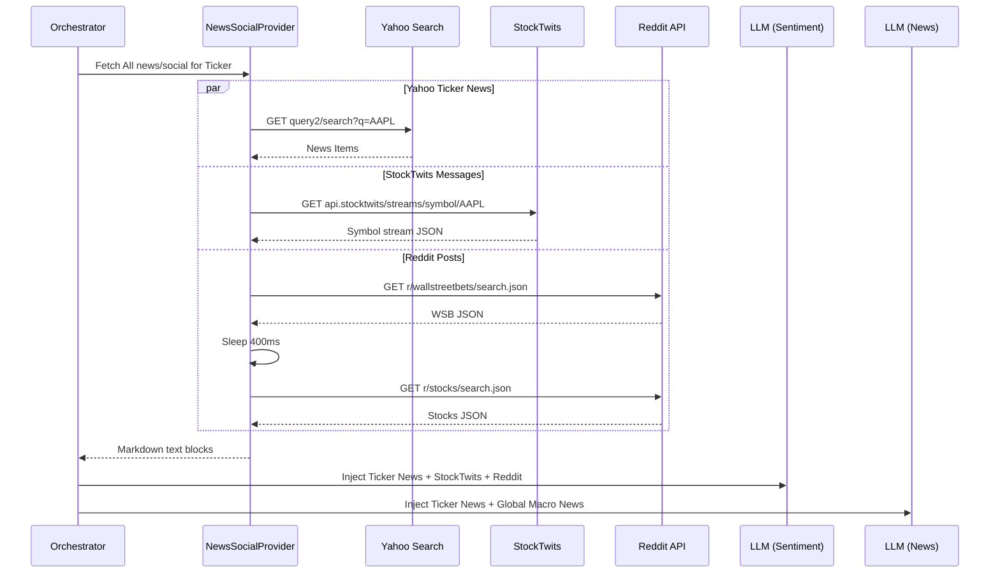

# Migration Plan: News & Social Media Ingestion

This document details the migration and implementation plan for bringing multi-source news and social media scrapers (Yahoo Finance News, StockTwits, and Reddit) from the sibling Python repository `TradingAgents` into the high-performance Go `trading-agents-go` backend.

## 1. Unified `NewsSocialProvider` Interface

We will define a unified contract to represent the multi-source data ingestion pipeline:

```go
package dataflow

import (
	"context"
	"time"
)

// NewsSocialProvider abstracts ticker-specific and global macro news/social ingestion flows.
type NewsSocialProvider interface {
	// FetchNews retrieves company-specific news articles between start and end dates.
	FetchNews(ctx context.Context, ticker string, start, end time.Time) (string, error)

	// FetchGlobalNews retrieves global macro economic news up to currDate.
	FetchGlobalNews(ctx context.Context, currDate time.Time, lookBackDays int, limit int) (string, error)

	// FetchStockTwits retrieves stocktwits message streams for the ticker.
	FetchStockTwits(ctx context.Context, ticker string, limit int) (string, error)

	// FetchReddit retrieves reddit posts mentioning ticker across subreddits.
	FetchReddit(ctx context.Context, ticker string, subreddits []string, limitPerSub int) (string, error)
}
```

## 2. Component Scraper Designs

### A. Yahoo Finance News Scraper (`news.go`)
- **API Endpoint**: `https://query2.finance.yahoo.com/v1/finance/search?q={query}&newsCount={limit}`
- **Lookup Mechanisms**:
  - For `FetchNews`: query is `{ticker}`.
  - For `FetchGlobalNews`: queries are fetched sequentially from a list of predefined macroeconomic search terms (interest rates, GDP, supply chain, central bank policy).
- **Date Filtering**: Parses the `providerPublishTime` Unix timestamp of each article. Rejects any articles published outside the requested `[start, end]` window to prevent look-ahead bias during historical runs.
- **Output Format**:
  ```markdown
  ### {Title} (source: {Publisher})
  Summary: {Summary}
  Link: {Link}
  ```

### B. StockTwits JSON Scraper (`stocktwits.go`)
- **API Endpoint**: `https://api.stocktwits.com/api/2/streams/symbol/{ticker}.json`
- **JSON Structure**: Uses `encoding/json` standard library for high-speed unmarshaling into strongly typed Go structs.
- **Sentiment Analysis**: Tallies user-labeled sentiment values (`Bullish`, `Bearish`, `no-label`) and generates a structured summary header showing percentage distributions.
- **Memory Optimization**: Uses `strings.Builder` with pre-allocated buffer sizes (`builder.Grow`) to minimize garbage collector overhead during layout rendering.

### C. Reddit JSON Scraper (`reddit.go`)
- **API Endpoint**: `https://www.reddit.com/r/{subreddit}/search.json?q={ticker}&restrict_sr=on&sort=new&t=week&limit={limit}`
- **Rate-Limiting Protection**: Wraps requests in the Go `ResilientHTTPClient`, implementing exponential backoff with full jitter for status `429` / `503`. Incorporates an explicit sequential inter-request sleep delay (e.g. 400ms) to ensure concurrent workers remain below the public IP limit (10 req/min).
- **Graceful Failure**: Catching rate limits or network issues, returning custom placeholders like `<reddit unavailable: status 429>` or `<no posts found>` so that the LLM analyst never faces standard panics.

---

## 3. Concurrent Fan-Out Ingestion & Prompt Injection

During **Phase B (Concurrent Market Analysis)**, we will execute a concurrent fan-out crawler.



### Prompt Engineering Changes

1. **`SentimentAnalystInstruction`**:
   The instruction prompt will be updated to expect pre-loaded data buffers:
   ```markdown
   <start_of_news>
   {news_block}
   <end_of_news>

   <start_of_stocktwits>
   {stocktwits_block}
   <end_of_stocktwits>

   <start_of_reddit>
   {reddit_block}
   <end_of_reddit>
   ```

2. **`NewsAnalystInstruction`**:
   The instruction prompt will be updated to include macroeconomic and ticker-specific news blocks:
   ```markdown
   <start_of_news>
   {news_block}
   <end_of_news>

   <start_of_global_news>
   {global_news_block}
   <end_of_global_news>
   ```

---

## 4. Verification Plan

1. **Unit Testing**:
   Write comprehensive unit tests in `internal/dataflow/news_social_test.go` verifying:
   - JSON parsing accuracy for StockTwits, Reddit, and Yahoo Search payloads.
   - Resilient HTTP retry behavior with mock rate-limiting servers returning `429`.
   - Thread-safety of simultaneous client accesses.

2. **E2E Integration Verification**:
   Execute the strategy backtest engine:
   ```bash
   go test -v ./internal/orchestrator/...
   ```
   Inspect the final analyst reports to verify details and ensure zero-fabrication metrics are maintained.
