# Parity Verification Harness & Differential Testing Specification

This document presents a structured architecture and implementation blueprint for building a **Parity Verification Harness & Differential Testing Suite**. This suite enables you to verify that the high-performance Go rewrite is mathematically, logically, and structurally identical to the original Python `TradingAgents` codebase.

---

## 1. High-Level Parity Architecture

To guarantee absolute alignment with the original project without manual auditing, we implement a multi-tiered **Differential Validation Framework**. This framework isolates deterministic mathematical logic from non-deterministic LLM generations.

```mermaid
graph TD
    subgraph "Tier 1: Deterministic Math"
        CSV[Sample OHLCV CSV] -->|Load| PY_Math[Python StockStats]
        CSV -->|Load| GO_Math[Go Indicators Engine]
        PY_Math -->|Output JSON| Diff_Math{Diff Engine}
        GO_Math -->|Output JSON| Diff_Math
        Diff_Math -->|Verify| Math_Pass[Mathematical Parity]
    end

    subgraph "Tier 2: Pipeline State Transitions"
        PARAMS[Ticker + Trade Date] -->|Mock LLM Responses| PY_Orch[Python Graph Orchestrator]
        PARAMS -->|Mock LLM Responses| GO_Orch[Go TradingOrchestrator]
        PY_Orch -->|State JSON| Diff_State{JSON Schema Diff}
        GO_Orch -->|State JSON| Diff_State
        Diff_State -->|Verify| State_Pass[Orchestration Sequence Parity]
    end
    
    subgraph "Tier 3: Look-Ahead Bias"
        RAW[Future-Leaked CSV] -->|Clean / Cutoff| PY_Filter[Pandas Filter]
        RAW -->|Stream Tokenize| GO_Filter[Go CSV Reader]
        PY_Filter -->|Export CSV| Diff_Filter{Line-by-Line Diff}
        GO_Filter -->|Export CSV| Diff_Filter
        Diff_Filter -->|Verify| Filter_Pass[Zero-Future Leak Parity]
    end
```



---

## 2. Tiered Verification Strategies

````carousel
### Tier 1: Mathematical Indicator Parity
To guarantee the Go zero-allocation indicators (`SMA`, `EMA`, `RSI`, `MACD`, `ATR`, `Bollinger Bands`, `MFI`) match the Python `stockstats` engine:
1. **Data Seed**: Export a historical slice (e.g., AAPL last 200 days) to a JSON or CSV file.
2. **Execute Python Reference**: Write a small Python script that runs `StockstatsUtils.get_stock_stats` for each indicator and saves a date-to-value map.
3. **Execute Go Candidate**: Build a lightweight verification binary in Go (`cmd/verify_math`) that runs the dynamic indicator resolver over the same CSV file.
4. **Tolerance Assertions**: Verify that $|Value_{Go} - Value_{Python}| < \epsilon$ (where $\epsilon = 10^{-5}$ accounts for minor IEEE 754 floating-point rounding discrepancies).

<!-- slide -->
### Tier 2: Pipeline State Transitions
To verify the logical execution steps (Analysts $\rightarrow$ Research Debate $\rightarrow$ Sizing & Risk $\rightarrow$ Portfolio Verdict):
1. **Mock LLM Providers**: Set up a local HTTP Mock Server (or inject dynamic mock clients) that return deterministic, pre-configured strings for both frameworks.
2. **Execute Workflows**: Run `main.py` (Python) and `cmd/tradingagents` (Go) for the same inputs.
3. **JSON State Extraction**: Export both final state structures into standardized JSON files:
   - Verify that all 4 analyst outputs exist and match.
   - Verify the exact number of debate turns in `InvestmentDebate.History` matches `maxDebateRounds`.
   - Verify equivalent final risk evaluations and final trade signal values (BUY/HOLD/SELL).

<!-- slide -->
### Tier 3: Look-Ahead Bias & Tokenization
To ensure the custom streaming tokenization doesn't introduce data leakage:
1. **Prepare Future Dataset**: Generate a CSV containing stock data beyond a targeted `tradeDate` cutoff.
2. **Verify Cutoff Boundaries**:
   - Assert that both the Python Pandas filter (`data[data["Date"] <= curr_date]`) and Go's tokenization cutoff (`parseCSVRowFast`) yield the exact same historical candle count.
   - Assert that no candle in the Go slice has a timestamp strictly greater than `tradeDate`.
````

---

## 3. Concrete Verification Tooling

Below is the design for an automated Python/Go harness script `scripts/verify_parity.py` that downloads historical candles, executes both verification engines, and outputs a detailed compatibility scorecard.

### 3.1. Go Math Verification Binary (`cmd/verify_math/main.go`)
Create a simple utility in the Go project to output indicator values in a unified JSON format:

```go
package main

import (
	"context"
	"encoding/json"
	"flag"
	"fmt"
	"os"
	"time"
	
	"tradingagents/internal/dataflow"
	"tradingagents/internal/indicators"
)

type IndicatorOutput struct {
	Date  string `json:"date"`
	Value float64 `json:"value"`
}

func main() {
	csvPath := flag.String("csv", "", "Path to raw candle CSV")
	indicator := flag.String("indicator", "", "Indicator to calculate, e.g. close_50_sma")
	tradeDateStr := flag.String("date", "", "Reference trade date")
	flag.Parse()

	// Read and stream candles using our high-performance stream tokenizer
	file, _ := os.Open(*csvPath)
	defer file.Close()
	
	tradeDate, _ := time.Parse("2006-01-02", *tradeDateStr)
	
	// Pre-calculated stream reader
	reader := dataflow.NewYahooFinanceCSVReader(nil) // Local parsing only
	candles, _ := reader.FetchAndStreamOHLCV(context.Background(), *csvPath, tradeDate)
	
	// Resolve indicator in-place
	cache := indicators.NewIndicatorCache()
	resolver := indicators.NewDynamicIndicatorResolver(cache)
	
	val, _ := resolver.Resolve(context.Background(), candles, "TEST", *indicator, tradeDate)
	
	output := IndicatorOutput{
		Date:  *tradeDateStr,
		Value: val,
	}
	
	jsonBytes, _ := json.MarshalIndent(output, "", "  ")
	fmt.Println(string(jsonBytes))
}
```

### 3.2. Automated Parity Script (`scripts/verify_parity.py`)
Run this script inside the workspace to verify math parity instantly.

```python
import subprocess
import json
import os
import pandas as pd
from stockstats import wrap

def verify_math_parity(symbol: str, indicator: str, date: str, lookback: int):
    print(f"🔬 Running Differential Test: {indicator} on {date}...")
    
    # 1. Run Python Reference
    # Emulate load_ohlcv cache or download
    csv_file = f"cache/{symbol}-YFin-data-reference.csv"
    os.makedirs("cache", exist_ok=True)
    
    if not os.path.exists(csv_file):
        import yfinance as yf
        df = yf.download(symbol, period="1y", multi_level_index=False)
        df.reset_index().to_csv(csv_file, index=False)

    data = pd.read_csv(csv_file)
    data["Date"] = pd.to_datetime(data["Date"])
    data = data[data["Date"] <= pd.to_datetime(date)]
    
    df_wrap = wrap(data)
    df_wrap[indicator]
    
    py_row = df_wrap[df_wrap["Date"].dt.strftime("%Y-%m-%d") == date]
    if py_row.empty:
        print("❌ Date not present in Python dataset")
        return False
        
    py_value = float(py_row[indicator].values[0])
    
    # 2. Run Go Binary Candidate
    # Pre-build: go build -o verify_math cmd/verify_math/main.go
    cmd = [
        "./verify_math",
        "-csv", csv_file,
        "-indicator", indicator,
        "-date", date
    ]
    result = subprocess.run(cmd, capture_output=True, text=True)
    if result.returncode != 0:
        print(f"❌ Go binary failed: {result.stderr}")
        return False
        
    go_data = json.loads(result.stdout)
    go_value = float(go_data["value"])
    
    # 3. Assert Parity
    diff = abs(py_value - go_value)
    tolerance = 1e-5
    
    if diff <= tolerance:
        print(f"✅ PASS: Py={py_value:.6f} | Go={go_value:.6f} | Diff={diff:.2e}")
        return True
    else:
        print(f"❌ FAIL: Py={py_value:.6f} | Go={go_value:.6f} | Diff={diff:.2e} (Exceeds tolerance {tolerance:.0e})")
        return False

if __name__ == "__main__":
    # Test multiple technical parameters
    indicators_to_test = [
        "close_10_ema",
        "close_50_sma",
        "rsi",
        "macd",
        "atr",
        "mfi"
    ]
    
    results = []
    for ind in indicators_to_test:
        res = verify_math_parity("AAPL", ind, "2026-05-15", 30)
        results.append((ind, res))
        
    passed = sum(1 for _, r in results if r)
    total = len(results)
    print(f"\n📊 Summary Scorecard: {passed}/{total} tests passed.")
```

---

## 4. Verification & Validation Checklist

Use this scorecard as you compile components to track parity compliance:

| Milestone / Component | Verification Strategy | Tolerance Boundary | Status |
| :--- | :--- | :--- | :--- |
| **Component 1 (Math)** | Differential test vs `stockstats`. | Difference $\le 10^{-5}$. | `[ ] Pending` |
| **Component 1 (Look-Ahead)** | Stream tokenizer size vs Pandas. | Row count matches exactly. | `[ ] Pending` |
| **Component 3 (LLM adapter)** | Schema payload unmarshaler checks. | Exact nested JSON structural match. | `[ ] Pending` |
| **Component 4 (Checkpointer)** | Serialization serialization checks. | Restored struct field equality. | `[ ] Pending` |
| **Component 5 (CLI)** | Obsidian Card printing comparison. | Match logs in `db/memory.md`. | `[ ] Pending` |
